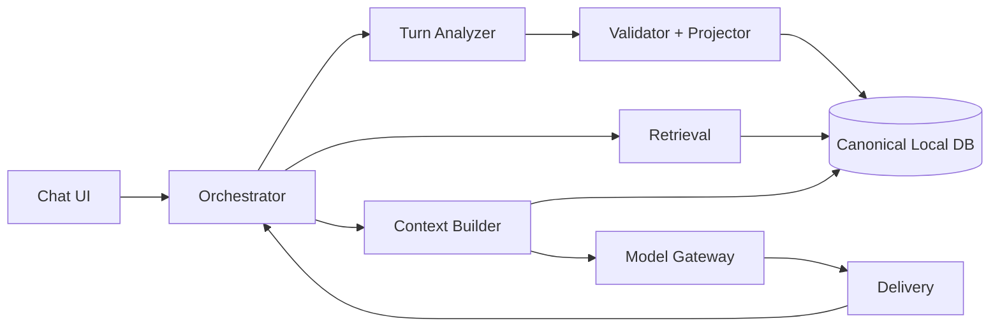
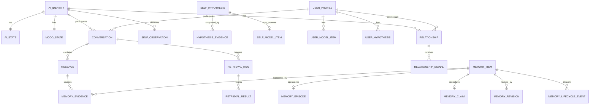

# PROJECT_HANDOFF.md

- Project: 自立型AI / 継続人格型デジタルコンパニオン
- Version: 0.1-draft-handoff-2026-09-27-r16-git
- Updated: 2026-09-27 JST
- Status: **Text v0.1 Definition of Ready監査完了 / Codex実コード未着手**
- Canonical continuation file: **このファイルを最初に読む**

> このGit版は、Codex実装着手に必要な情報を読みやすく分割したhandoff。要求を削除した版ではない。詳細要求は`docs/handoff/`、P0実装契約は`docs/`を正とする。

---

# 1. 目的と範囲

詳細: [`docs/handoff/01_SCOPE.md`](docs/handoff/01_SCOPE.md)

主利用者は開発者本人。目標はQ&Aツールではなく、PC内で継続して存在する**同一個体の相棒型AI**。

v0.1はText-firstで、以下を最初に成立させる。

- 再起動・複数sessionをまたぐIdentity / Memory / Self / User / Relationshipの連続性。
- Userの意見をAIの意見へ自動転写しない。
- 未形成の好み・意見をUnknownとして扱える。
- 重要な過去情報を必要時にRecallできるが、Recallしたから必ず発言するわけではない。
- Memoryの訂正・時間変化・forgetを非破壊で扱う。
- 数日使ったログから、次に改善すべきsubsystemを特定できる。

長期要求として、Voice / Avatar / Vision / Web / PC操作 / Game / Skill / Drive・Intent / 不在時自主活動 / Permission / Plugin・MCP / Multi-surface / Model Evolutionを**削除せず保持**する。

---

# 2. 要件

Canonical requirement files:

1. [`docs/handoff/02_REQUIREMENTS_AI.md`](docs/handoff/02_REQUIREMENTS_AI.md) — `REQ-AI-001〜058`。全体・長期要求。
2. [`docs/handoff/03_REQUIREMENTS_V01_A.md`](docs/handoff/03_REQUIREMENTS_V01_A.md) — v0.1 Core / Memory / Self / User / Relationship / Affect / UI / ORCH-01〜24。
3. [`docs/handoff/04_REQUIREMENTS_V01_B.md`](docs/handoff/04_REQUIREMENTS_V01_B.md) — ORCH-25〜76 / Analyzer / Retrieval / Explicit Command / DoR。

重要な実装前決定:

- `REQ-V01-CORE-03`: Self/User分離。
- `REQ-V01-MEM-09`: User Forgetは`soft_deleted`。AIから不可視、Developer auditは残す。
- `REQ-V01-MEM-10`: AI自身はACTIVE→ARCHIVEDのみ。soft delete不可。
- `REQ-V01-ORCH-35/62/73`: Assistant canonical messageは**実際にdeliveryされた範囲だけ**。
- `REQ-V01-ORCH-56/74`: semantic Domain mutationはValidator + Projector経由のみ。
- `REQ-V01-ORCH-59`: Main failureはdelivery前だけfallback可。delivery後の無言model継ぎ足し禁止。
- `REQ-V01-RETR-05`: Retrieval後にstate revisionが変わればContext投入前にvisibility再検証。
- `REQ-V01-CMD-02/03`: 曖昧なforgetでは削除しない。一意解決できたforgetのみforeground atomic soft-delete。
- `REQ-V01-DOR-01`: r16監査時点でP0 blocker 0、Codex着手可能。

---

# 3. 設計

## 3.1 P0 architecture



P0 component contractのcanonical詳細:

- [`docs/TEXT_V01_IMPLEMENTATION_SPEC.md`](docs/TEXT_V01_IMPLEMENTATION_SPEC.md)
- [`docs/text_v01/01_CORE_CONTRACTS.md`](docs/text_v01/01_CORE_CONTRACTS.md)
- [`docs/text_v01/02_COMPONENT_DETAILS.md`](docs/text_v01/02_COMPONENT_DETAILS.md)
- [`docs/text_v01/03_RUNTIME_ACCEPTANCE.md`](docs/text_v01/03_RUNTIME_ACCEPTANCE.md)
- [`docs/text_v01/04_EXPLICIT_COMMANDS.md`](docs/text_v01/04_EXPLICIT_COMMANDS.md)

## 3.2 Foreground / background

```text
TextSubmit
→ UserTurnCommitted
→ [parallel] Retrieval + current Domain snapshot + recent context
→ immutable ContextCapsule
→ Main Dialogue LLM stream
→ Delivery checkpoint
→ canonical Assistant Message
→ user-facing turn complete
──────────────
→ async Turn Analyzer
→ Validator / Projector
→ atomic Domain commit
```

Analyzer完了は次turn開始の前提にしない。

## 3.3 State ownership

- Turn lifecycle / event sequence / cancel scope: Orchestrator single-writer。
- Retrieval result: Retrieval所有、Domain read-only。
- Context Capsule: Context Builderがimmutable Snapshotとして作成。
- Provider session/cache: Gateway以下。
- Delivery truth: Delivery。
- Memory / Self / User / Relationship / Affect: Validator + Projector経由のDomain Update Layerだけが確定mutation。

## 3.4 Memory / Self / User / Relationship

- MemoryはEpisodeとClaimを分離。
- 訂正は過去Episodeを消さず、current Claimをrevisionする。
- correction / clarification / change-over-timeを区別。
- Explicit Rememberは強い保存signal。ただしsecret/credentialは保存しない。
- Self Observationはspontaneity / user influenceを分け、User誘導だけでSelf Modelへ昇格させない。
- Direct User FactとBehavioral inferenceを分ける。
- Relationshipはfamiliarity / trust / comfort / shared history / interaction style等の多次元。利用頻度だけで愛情・依存を断定しない。

## 3.5 Retrieval

Canonical詳細: [`docs/RETRIEVAL_P0_SPEC.md`](docs/RETRIEVAL_P0_SPEC.md)

- extracted Memory + canonical raw conversationのhybrid。
- lexical / semanticを差替可能に併用。
- `soft_deleted`は結果0件。
- archivedは通常低優先だが、明示参照で再浮上可能。
- Recall ≠ Mention。
- exact scoring weight / threshold / reranker条件 / Embedding modelは実働後に決める。

## 3.6 Analyzer

Canonical詳細: [`docs/ANALYZER_GOLDEN_SPEC.md`](docs/ANALYZER_GOLDEN_SPEC.md)

- `TurnAnalysisV1`はproposalでありDB確定値ではない。
- UUID / timestamp / numeric confidence / lifecycle / delete / promotion / Relationship数値はcode-owned。
- Empty resultは正常。
- P0 GoldenはSelf/User混同、correction/change-over-time、explicit remember、secret、undelivered tail、valid no-op等の高リスク境界だけを実装前に固定。

## 3.7 Remote / Colab

- canonical AI Core / DB / Identity / Memory / Relationshipはlocal権威。
- Colab等remoteは交換可能なephemeral inference worker。
- `LOCAL_ONLY` / `HYBRID_COLAB_MAIN`で上位contractは同一。
- Remoteへsoft-deleted / secret / private-suppressed / raw DB dumpを送らない。

## 3.8 Long-term Voice

v0.1の実装対象外だが設計要求は保持。

- VAD / semantic turn detection / streaming ASR / LLM stream / incremental TTSを重ねて体感latencyを下げる。
- first speakable fragment優先。
- barge-inは第一級event。
- 未再生tailはcanonical conversation / Memory evidenceにしない。
- Voice latencyは`last user audio sample → first bot playout sample`を中心に計測。
- Safe / Balanced / Aggressive profileを将来比較。Balancedを既定候補として保持。

## 3.9 ER

Domain側の主要関係:



Runtime traceはDomain ERと分離し、`TURN_RUN / TURN_EVENT_TRACE / COMPONENT_ATTEMPT / CONTEXT_SNAPSHOT / MODEL_INVOCATION / DELIVERY_SPAN / CANCELLATION_SCOPE / TURN_ANALYSIS`等で追跡する。

---

# 4. 判断

## 明示決定 / 方向性の合意

- 初期人格を与えつつ、経験で変化可能にする。
- User opinionをAI opinionへ自動コピーしない。
- Unknownを有効状態にする。
- User不在時の自主活動を長期要求として許可。ただしCoreが実際に稼働している時だけ。
- AIは「一人でいたい」状態を持ってよいが、明示依頼には原則応答。
- User Forgetはsoft delete。
- AI自身のAutonomous Archiveをv0.1から許可。
- 育成型開発を採用。
- v0.1 UIは汎用的なChat中心。
- 実装前の過剰仕様化はr16で打ち止め。

## AI提案・採用候補

- Foreground Main LLM ×1 + async Analyzer ×1。
- Local canonical state + optional Colab Main。
- Retrievalはhybrid lexical + semantic。
- Developer InspectorをP0後半で用意。
- 将来の中間進化はPrompt/State → curated data → LoRA/SFT → preference tuning → deeper editingの順で進める。

## 保留

- Main model / Analyzer model / Embedding modelの最終採用。
- Local Main vs Colab Mainの既定profile。
- exact retrieval scoring / threshold / reranker。
- Context token budget最終値。
- Emotion/Relationship numeric mapping。
- Voice ASR/TTS/VAD/turn detector。
- P1 Golden完全化。

これらはCodex着手ブロッカーではない。

---

# 5. 最初の実装

Codex Work Package順:

```text
WP-TXT-01 Canonical Domain schema + repository contract
↓
WP-TXT-02 Turn / Event / Attempt lifecycle
↓
WP-TXT-03 Retrieval + WP-TXT-04 Context Builder
↓
WP-TXT-05 Gateway/Main streaming + WP-TXT-06 Delivery truth
↓
「1ターン普通に会話できる」foreground vertical slice
↓
WP-TXT-07 Turn Analyzer + WP-TXT-08 Validator/Projector
↓
persistent Memory / Self / User / Relationship vertical slice
↓
WP-TXT-09 Developer Inspector + WP-TXT-10 Golden Harness
```

最初の完了報告では、**実装したWP / 実際に動作確認した範囲 / 未実装 / 仕様変更 / test result / known issue**を分けて報告する。

「コードが存在する」と「実装・検証済み」は別扱い。

---

# 6. 参照資料

実装repo内の正本:

- `PROJECT_HANDOFF.md` — 最上位handoff。
- `docs/handoff/01_SCOPE.md`
- `docs/handoff/02_REQUIREMENTS_AI.md`
- `docs/handoff/03_REQUIREMENTS_V01_A.md`
- `docs/handoff/04_REQUIREMENTS_V01_B.md`
- `docs/TEXT_V01_IMPLEMENTATION_SPEC.md` + `docs/text_v01/*`
- `docs/TEXT_V01_READINESS_AUDIT.md`
- `docs/ANALYZER_GOLDEN_SPEC.md`
- `docs/RETRIEVAL_P0_SPEC.md`
- `CODEX_START.md`

外部調査は企画段階でNeuro-sama / AIRI / Open-LLM-VTuber / llama.cpp / vLLM / Colab / LiveKit / Pipecat / memory・agent評価研究等を参照した。実装時にfast-moving技術の具体API/互換性を使う場合は、その時点の一次資料を再確認する。

未実施:

- 候補Local modelの実機benchmark。
- Local vs Colabの同一scenario比較。
- Voice latency harness実測。
- 3日以上のcontinuity test。

---

# 7. 再開情報

## 現在地

Text v0.1は**Definition of Ready: READY / P0 blocker 0**。

実コード、DB migration、deployment code、automated test code、benchmarkはまだ未着手。

## 次の作業

1. Codexで`WP-TXT-01`から実装開始。
2. `WP-TXT-01 → 02 → 03+04 → 05+06`でforeground vertical sliceを先に動かす。
3. 実装報告を企画側へ戻し、仕様との差分・設計変更・未決事項を更新する。
4. P1 Golden / exact tuning / Voice詳細は、初期実働ログまたは各フェーズ直前に追加する。

## 読む順序

1. `PROJECT_HANDOFF.md`
2. `docs/handoff/02_REQUIREMENTS_AI.md`
3. `docs/handoff/03_REQUIREMENTS_V01_A.md`
4. `docs/handoff/04_REQUIREMENTS_V01_B.md`
5. `docs/TEXT_V01_IMPLEMENTATION_SPEC.md` → `docs/text_v01/*`
6. `docs/TEXT_V01_READINESS_AUDIT.md`
7. `docs/ANALYZER_GOLDEN_SPEC.md`
8. `docs/RETRIEVAL_P0_SPEC.md`
9. `CODEX_START.md`

## 重要ルール

- 長期要求をv0.1外だからという理由で削除しない。
- 未決事項を勝手に確定しない。
- 仕様矛盾やP0 blockerが見つかったら、大きな設計変更を独断で入れず報告する。
- ライブラリ選択・内部関数分割・物理列/JSON trace等、仕様の意味を変えない実装詳細はCodex判断でよい。
