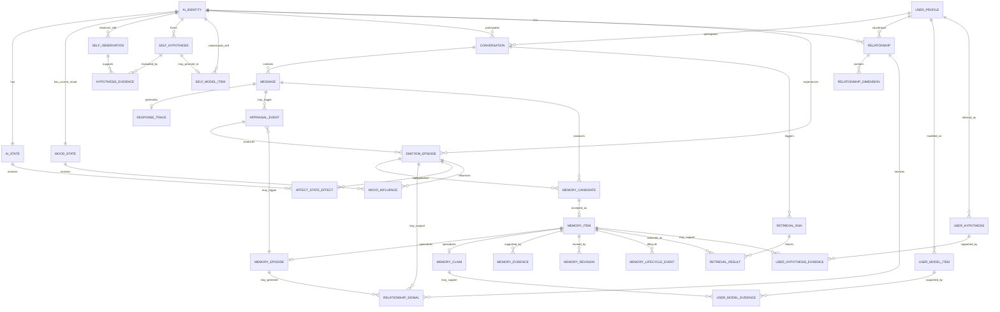

# 3. 設計

## 3.1 全体概念
```text
ENVIRONMENT
 User / PC / Web / Game / Time
        ↓
PERCEPTION
        ↓
BELIEF / WORLD MODEL  [全体構想、v0.1独立Entity化は保留]
        ↓
SELF ─ USER MODEL ─ RELATIONSHIP
        ↓
APPRAISAL
        ↓
EMOTION / MOOD / AI_STATE
        ↓
INTENT / ACTION GATE [後続]
        ↓
WAIT / THINK / ACT
        ↓
EXPERIENCE
        ↓
MEMORY / SELF / RELATIONSHIP 更新
```

## 3.2 v0.1会話時の暫定処理
```text
USER MESSAGE
   ↓
Recent Context + Recall
   ↓
Self/User/Relationship/State context
   ↓
Appraisal
   ↓
Emotion/State update
   ↓
Prompt assembly
   ↓
Dialogue LLM
   ↓
Response stream
   ↓  (非同期候補)
Memory candidate / Self observation / Trace
```

※ この旧暫定フローは後続の §3.7 Orchestrator設計案で具体化・一部置換。Appraisal/Stateの永続更新はforegroundで別LLM callにせず、原則post-turn Analyzerでformalizeする案を第一候補とする。

## 3.3 現在の論理ER図


### 3.3.1 v0.1コアEntity属性（会話で合意・提案していた詳細を復元）
以下は実装開始時の論理スキーマ基準。型は実装DBで調整可能だが、意味・PK/FK・分離原則は保持する。

| Entity | 主な属性 | 重要制約 |
|---|---|---|
| `AI_IDENTITY` | `id PK`, `name`, `entity_type`, `role`, `core_identity json`, `temperament json`, `created_at`, `updated_at` | LLM model IDをIdentityそのものにしない |
| `AI_STATE` | `id PK`, `ai_identity_id FK UNIQUE`, `curiosity`, `social_interest`, `engagement`, `fatigue_like`, `updated_at` | 1 AI : 1 current state。擬似肉体状態ではなく運用上意味のある内部状態 |
| `MOOD_STATE` | `id PK`, `ai_identity_id FK UNIQUE`, `valence`, `activation`, `control`, `last_updated_at` | Emotionより遅く変化し、停止時間を含めdecay |
| `USER_PROFILE` | `id PK`, `display_name`, `stable_attributes json`, `created_at`, `updated_at` | AI Selfとは完全分離 |
| `CONVERSATION` | `id PK`, `ai_identity_id FK`, `user_profile_id FK`, `started_at`, `ended_at` | Session境界はIdentity/Memory境界ではない |
| `MESSAGE` | `id PK`, `conversation_id FK`, `speaker`, `content`, `channel`, `status`, `created_at`, `completed_at` | `content`はcanonicalにユーザーへdeliveryされた範囲。生成したが未表示/未発話のtailはResponse Trace側へ残しても共有会話Evidenceにしない |
| `MEMORY_CANDIDATE` | `id PK`, `source_message_id FK`, `candidate_type`, `proposed_content/summary`, `proposed_importance`, `decision`, `decision_reason`, `evaluated_at` | LLM候補を直接DB確定値にしない |
| `MEMORY_ITEM` | `id PK`, `ai_identity_id FK`, `memory_kind`, `summary`, `importance`, `status`, `retention_class`, `happened_at`, `created_at`, `last_recalled_at`, `last_mentioned_at`, `recall_count`, `mention_count` | v0.1ではEpisode/Claimの共通親。`soft_deleted`はRecall/Prompt/Evidenceから除外 |
| `MEMORY_EPISODE` | `memory_item_id PK/FK`, `event_type` | 過去に起きた出来事。現在Claim訂正で破壊しない |
| `MEMORY_CLAIM` | `memory_item_id PK/FK`, `subject_type`, `predicate`, `object_value`, `confidence`, `claim_status`, `valid_from`, `valid_to` | Current understanding。旧Claimはsuperseded等で履歴化 |
| `MEMORY_EVIDENCE` | `id PK`, `memory_item_id FK`, `message_id FK`, `evidence_type`, `support_weight` | Provenanceは実在sourceへ参照 |
| `MEMORY_REVISION` | `id PK`, `memory_item_id FK`, `revision_type`, `previous_value`, `new_value`, `reason`, `created_at` | correction/change_over_time/clarification/deletionを区別 |
| `MEMORY_LIFECYCLE_EVENT` | `id PK`, `memory_item_id FK`, `event_type`, `actor_type`, `reason_type`, `reason`, `confidence`, `created_at` | CREATED/ARCHIVED/REACTIVATED/SOFT_DELETED等を追跡 |
| `SELF_OBSERVATION` | `id PK`, `ai_identity_id FK`, `source_message_id FK`, `observation_type`, `subject`, `description`, `spontaneity`, `user_influence`, `context_key`, `observed_at` | 自発性/ユーザー誘導度をSelf証拠へ反映 |
| `SELF_HYPOTHESIS` | `id PK`, `ai_identity_id FK`, `category`, `subject`, `statement`, `confidence`, `status`, `created_at`, `updated_at` | 単一経験でCore/Self Modelへ昇格しない |
| `HYPOTHESIS_EVIDENCE` | `id PK`, `self_hypothesis_id FK`, `self_observation_id FK`, `polarity`, `evidence_weight`, `independence_weight`, `created_at` | 支持/反証、context diversityを評価可能にする |
| `SELF_HYPOTHESIS_REVISION` | `id PK`, `self_hypothesis_id FK`, `previous_confidence`, `new_confidence`, `previous_status`, `new_status`, `reason`, `created_at` | 昇格/低下理由を追跡 |
| `SELF_MODEL_ITEM` | `id PK`, `ai_identity_id FK`, `source_hypothesis_id FK`, `category`, `subject`, `value`, `confidence`, `stability`, `origin`, `status`, `valid_from`, `valid_to` | Core Identity/initial temperamentとLearned Selfを分離 |
| `SELF_MODEL_EVIDENCE` | `id PK`, `self_model_item_id FK`, `self_observation_id FK`, `support_weight` | learned selfの根拠を追跡 |
| `USER_MODEL_ITEM` | `id PK`, `user_profile_id FK`, `category`, `subject`, `value`, `confidence`, `temporal_scope`, `status`, `valid_from`, `valid_to`, `updated_at` | direct confirmed/current/long-termを区別 |
| `USER_MODEL_EVIDENCE` | `id PK`, `user_model_item_id FK`, `memory_claim_id FK`, `support_weight` | User Modelの根拠をClaimへ戻せる |
| `USER_HYPOTHESIS` | `id PK`, `user_profile_id FK`, `category`, `subject`, `statement`, `confidence`, `status`, `created_at`, `updated_at` | 推測を確認済みprofileと混同しない |
| `USER_HYPOTHESIS_EVIDENCE` | `id PK`, `user_hypothesis_id FK`, `memory_item_id FK`, `polarity`, `evidence_weight` | 推測の支持/反証を保持 |
| `RELATIONSHIP` | `id PK`, `ai_identity_id FK`, `user_profile_id FK`, `started_at`, `updated_at` | 1本の親密度数値へ圧縮しない |
| `RELATIONSHIP_DIMENSION` | `id PK`, `relationship_id FK`, `dimension_type`, `value`, `confidence`, `stability`, `updated_at` | familiarity/trust/comfort/shared-history/style等。Trustは可能な限り文脈依存 |
| `RELATIONSHIP_SIGNAL` | `id PK`, `relationship_id FK`, `source_episode_id FK nullable`, `signal_type`, `strength`, `reason`, `observed_at` | 1回の小イベントで大幅変化させない |
| `RELATIONSHIP_DIMENSION_EVIDENCE` | `id PK`, `relationship_dimension_id FK`, `relationship_signal_id FK`, `support_weight` | 関係変化の根拠を追跡 |
| `APPRAISAL_EVENT` | `id PK`, `source_message_id FK nullable`, `source_memory_episode_id FK nullable`, `pleasantness`, `novelty`, `relevance`, `goal_alignment`, `controllability`, `cause_type`, `target_type`, `target_ref`, `created_at` | Event→Emotionの根拠。sourceのどちらかは原則必須 |
| `EMOTION_EPISODE` | `id PK`, `ai_identity_id FK`, `appraisal_event_id FK`, `primary_type`, `optional_label`, `intensity`, `target_type`, `target_ref`, `action_tendency`, `status`, `started_at`, `last_updated_at`, `ended_at` | 現在感情と過去の感情記憶を分離 |
| `AFFECT_STATE_EFFECT` | `id PK`, `emotion_episode_id FK`, `ai_state_id FK`, `state_dimension`, `delta`, `applied_at` | State updateを追跡 |
| `MOOD_INFLUENCE` | `id PK`, `emotion_episode_id FK`, `mood_state_id FK`, `valence_delta`, `activation_delta`, `control_delta`, `applied_at` | 単発EmotionをMoodへ全量コピーしない |
| `RETRIEVAL_RUN` | `id PK`, `conversation_id FK`, `query_text`, `scoring_config json`, `created_at` | どのquery/scoringでRecallしたか追跡 |
| `RETRIEVAL_RESULT` | `id PK`, `retrieval_run_id FK`, `memory_item_id FK nullable`, `message_id FK nullable`, `semantic_score`, `lexical_score`, `final_score`, `rank` | extracted memoryとraw message両方を扱える |
| `RESPONSE_TRACE` | `id PK`, `message_id FK UNIQUE`, `state_snapshot json`, `model_config json`, `prompt_context_summary json`, `latency_ms`, `created_at` | private chain-of-thoughtではなく構造化された入力/結果/計測だけを保存 |

#### v0.1コア多重度・任意性ルール
- `AI_IDENTITY` : `AI_STATE` = 1:1、`AI_IDENTITY` : `MOOD_STATE` = 1:1。
- `MEMORY_ITEM`はv0.1では原則として`MEMORY_EPISODE`または`MEMORY_CLAIM`のどちらか一方にspecializeする。将来型追加を妨げない。
- `MEMORY_CANDIDATE`はrejectされ得るため`MEMORY_ITEM`は0..1。
- `soft_deleted MEMORY_ITEM`は通常Recall、Prompt、Self/User/Relationship evidence selectionから除外する。
- `SELF_HYPOTHESIS`→`SELF_MODEL_ITEM`は0..1。昇格しない仮説が通常存在する。
- `USER_HYPOTHESIS`は直接確認された`USER_MODEL_ITEM`と別物。推測のみで自動確定しない。
- `RELATIONSHIP_SIGNAL`は全Turnで必須ではない。通常雑談はno-changeでよい。
- Appraisal/Emotionも毎Turn必須ではなく、意味のある変化がない場合は生成しない設計を許す。

## 3.4 Memory状態
```text
ACTIVE ↔ ARCHIVED
  │          │
  └────┬─────┘
       ↓  (ユーザーのみ)
SOFT_DELETED
```
- AIはACTIVE→ARCHIVED可能。
- AIはsoft delete不可。
- User forgetはsoft deleteでAIから完全不可視。
- Developer履歴にはLifecycle Eventを残す。
- `ARCHIVED`は「AIから消えた」ではなく通常Recall優先度を大きく下げた状態。強い関連や明示言及で再活性化候補になれる。
- v0.1のAI自律Archiveは、低重要度・低関連・長期未使用等を候補にするが、Core相当、Promise/Commitment、重要なcurrent Claim、relationship-critical memoryは単純な経過時間だけでArchiveしない。
- 明示的な「覚えて」は強い保存シグナル。ただしpassword/API key/auth token等の秘密情報はlong-term Memoryへ保存しない。

## 3.5 UI方針
- 汎用的・見やすいChat UI。
- 特殊なDashboardを主画面にしない。
- Developer Inspectorは別モード/Panel。
- UI参考探しは機能要件へ勝手に影響させない。
- Motion: https://transitions.dev/ を主要参考。

## 3.6 技術候補（未決）
- AI CoreとModel Gatewayを分離。
- Local backend候補: llama.cpp / Ollama / その他。
- Model/Runtimeは実機benchmarkで交換可能にする。
- DB: v0.1はSQLite中心が有力。Vector retrievalは拡張/別storeを比較。
- Memory pipelineは会話返答をブロックしない非同期化が有力。

## 3.7 Orchestrator設計案（2026-09-26調査反映 / AI提案）

### Foreground critical path
```text
USER MESSAGE
   ↓
[deterministic] normalize / explicit remember-forget-command
   ↓
   ├── [parallel] DB: Self / User / Relationship / Mood / State load
   ├── [parallel] hybrid Recall: vector + lexical (+ optional entity)
   └── [parallel] recent-context preparation
            ↓
      CONTEXT CAPSULE
            ↓
   MAIN DIALOGUE MODEL ×1
            ↓ stream immediately
        RESPONSE
```

### Background post-turn path
```text
USER + AI TURN
      ↓
TURN ANALYZER ×1 (structured JSON; SLM有力)
      ↓
├─ Memory Candidate / Claim candidate
├─ Self Observation
├─ User Hypothesis candidate
├─ Appraisal / Emotion candidate
└─ Relationship Signal candidate
      ↓
[deterministic validators / policy / confidence / lifecycle]
      ↓
transactional commit
```

### 原則
- Memory Recall / User / Self / Relationship / Appraisalを別々のLLM callへ分解しない。
- Main Dialogue Modelには自然会話・人格・ニュアンスを集中させる。
- DB mutationはMain Dialogue Modelへ直接任せない。
- semanticだがboundedな後処理は一つのmulti-task Turn Analyzerへ集約する。
- Analyzerが未完でもrecent conversationには直前turnが存在するため次会話を継続可能にする。
- 「忘れて」など即時性のある明示commandはbackground待ちにせずdeterministic pathで先に適用する。
- Background処理はforeground到着時にpause/cancel/deprioritize可能にする。

### Retrieval方針
- v0.1初期比較対象: SQLite FTS5 lexical + vector similarity + rank fusion。
- Memory Item（抽出されたClaim/Episode）だけでなく、必要に応じraw conversation chunkもretrieval対象にする。
- Rerankerは常時必須にせず、上位候補が近い/候補数が多い/重要query等でoptional。
- Query rewritingを別LLM callとしてforegroundへ常設しない。Recall失敗scenarioでのみ後から比較。

### Prompt / cache方針
- Hard system rules / Identity Kernel等、静的部分をprompt先頭へ固定し、prefix-cache再利用を狙う。
- Dynamic Context Capsuleはコンパクトに保つ。
- retrieval contextを毎turn差し替えるため、v0.1では会話全体のKV再利用へ過度に依存せず、正しさとtraceabilityを優先。
- runtimeのcontext checkpoint / cache機能はbenchmark後に最適化対象とする。

### Runtime候補
- 標準GGUF等: stock llama.cpp serverが第一比較候補。schema-constrained JSON、prompt cache、continuous batching、rerank endpoint、speculative decoding等を持つ。
- 高throughput/複数GPU等: vLLMも比較候補。
- Ternary Bonsai 2のPTQ1_0/PQ2_0を使う場合: 現時点ではPrismML fork runtimeが必要で、stock llama.cpp/Ollama/LM Studio GGUFでは不可。
- runtime/model選択はHardware profile取得後にbenchmarkして決定。
