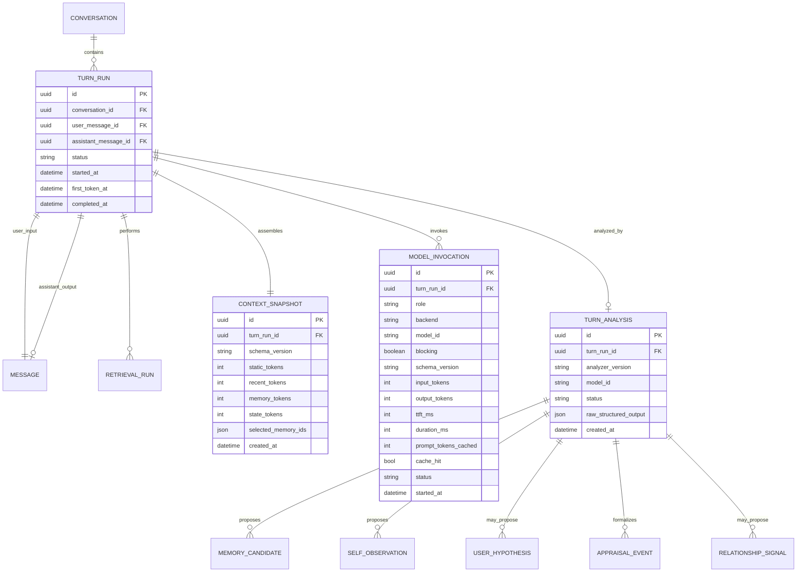
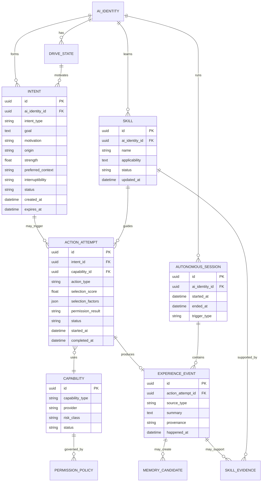
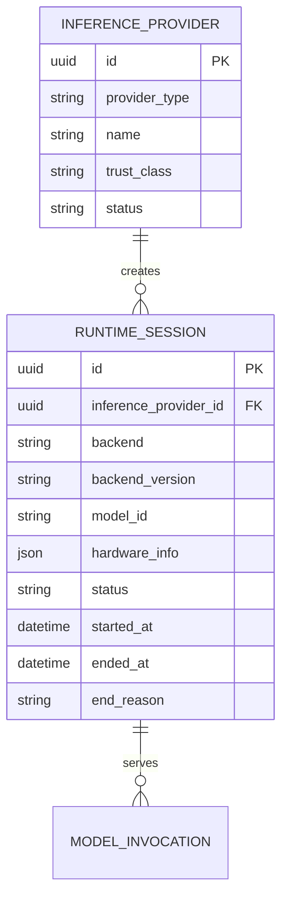

## 3.8 中間進化 / Model Evolution方針（AI提案）
ユーザーが参考として挙げたHikari07jpのBonsai編集は、公開情報上は一般的なPersona fine-tuningではなく、Bonsai 2 PQ2_0の配布quantization lattice上で2-bit codeを直接編集するquant-native abliterationのpreview。手法の詳細は未公開。

今回参考にするのは安全除去という目的ではなく開発方法:
1. 変更対象を狭く定義する。
2. edit強度をsweepする。
3. 狙った挙動だけが変わったか専用harnessで測る。
4. coding/math/tool/multi-turn/persona/memory等のregressionを同時検査する。
5. 実測が悪ければrollbackできるversioned artifactにする。

本プロジェクトの中間進化候補:
```text
Stage 0: Prompt + Persistent State + Memory（v0.1）
  ↓ 実利用ログ蓄積
Stage 1: curated persona dataset + regression set
  ↓
Stage 2: versioned Persona LoRA / SFT
  ↓
Stage 3: accepted/edited/rejected repliesを使ったPreference tuning(DPO等)を比較
  ↓
Stage 4: 十分な検証基盤ができた後のみ、merge/量子化後編集等のより深い手法を研究
```

Baseを凍結してadapterをversion管理する方式を最初に優先し、人格の進化とbase能力劣化を分離して評価する。過去世代の代表caseをreplay/regression setとして保持し、catastrophic forgetting/persona driftを検査する。

## 3.9 Orchestrator追跡用ER addendum（AI提案）


重要制約:
- `TURN_ANALYSIS` は `turn_run_id + analyzer_version` でidempotentに再実行可能にする。
- `MODEL_INVOCATION.role` 例: dialogue / analyzer / embedding / reranker / reflection。
- `CONTEXT_SNAPSHOT`は生のprivate chain-of-thoughtを保存するものではなく、使用した構造化contextとtoken budgetを追跡する。
- analyzer outputから実データへ反映する際は既存のEvidence/Lifecycle/Revision entityを経由する。


## 3.10 長期Capability/Autonomy概念ER（保持用・論理詳細は未確定）
以下はv0.1 ERへ無理に混ぜず、将来機能を消失させないための概念レベル。多重度・属性の詳細は各フェーズで確定する。



将来接続予定: Voice/STT/TTS、Avatar、Vision/Screen、Web、PC、Gameはすべて`CAPABILITY`/`PERCEPTION`側から同一AI Coreへ入れ、別人格を作らない。

Action selectionでは、少なくとも desire/interest/timeliness/relationship/novelty/incompleteness と interruption/repetition/risk/cost/recent_action を入力候補として保持する。固定式は未決で、育成ログから調整する。`WAIT`は常に有効な候補とする。

外部Perceptionは将来 `source_type / source_ref / observed_at / trust_class / provenance` を持つイベントへ正規化し、Web/文書/ゲーム/第三者入力を直接Identityや高権限命令へ昇格させない。

## 3.12 Remote / Colab inference候補（2026-09-26 r6、採用未決）

### 基本方針
Colab等のremote GPUは **AI本体ではなく交換可能なInference Provider** として扱う。AI Core、SQLite/Memory、Self/User/Relationship、Scheduler、Permission/forget境界は原則ローカルに残す。Remote runtimeは切断・再作成されることを正常系として設計する。

```text
LOCAL MACHINE (authoritative)
 Chat UI / AI Core / DB / Memory / Scheduler
        │
        │ Context Capsule + request
        ▼
 MODEL GATEWAY
   ├─ Local Provider
   ├─ Colab Ephemeral Provider   [候補]
   └─ Dedicated Cloud/API        [将来候補]
        │
        ▼
 response stream / structured result
        │
        ▼
 LOCAL validation / commit
```

### Colabの位置づけ
- 適する: Bonsai等のGPU benchmark、モデル比較、LoRA/SFT/DPO等の学習・中間進化実験、短時間の高性能Main推論、Analyzer比較。
- 不向き: 24/7常駐AI Core、唯一のMemory DB、切断不可のAutonomous loop、常時提供が必須のproduction backend。
- Colab runtimeのGPU種別/使用上限/最大寿命は変動するため、モデル性能評価には`runtime hardware + backend commit + quantization + context`を必ず記録する。
- Remoteへはcanonical DBを渡さず、必要なContext Capsuleのみ送る。Remote modelはDBを直接mutationせず、結果はlocal Validator/Projectorを通す。
- Colab終了後もConversation/Memory/Self/Relationshipはローカルから完全復元できることをInvariantとする。

### Deployment Profiles
1. `LOCAL_ONLY`: Main/Analyzer/Embeddingすべてローカル。
2. `HYBRID_COLAB_MAIN`: AI Core/DB/Recallはローカル、Main DialogueのみColab。Analyzerはローカル優先。
3. `HYBRID_COLAB_HEAVY`: Main + bounded AnalyzerをColab、DB/validation/commitはローカル。実験用。
4. `REMOTE_DEDICATED`: 将来の常時運用向け。Colabではなく保証型VM等を想定。

第一候補は、Colabを採用する場合でも `HYBRID_COLAB_MAIN`。Mainが重いほどremote GPUの恩恵が大きく、Memory/forget/privacy/identityの正しさはローカルで維持できる。

### Runtime観測ER addendum


この追加はMemory/Self等の論理モデルを変えず、`MODEL_INVOCATION`がどのruntimeで実行されたかを追跡するための運用Entity。
