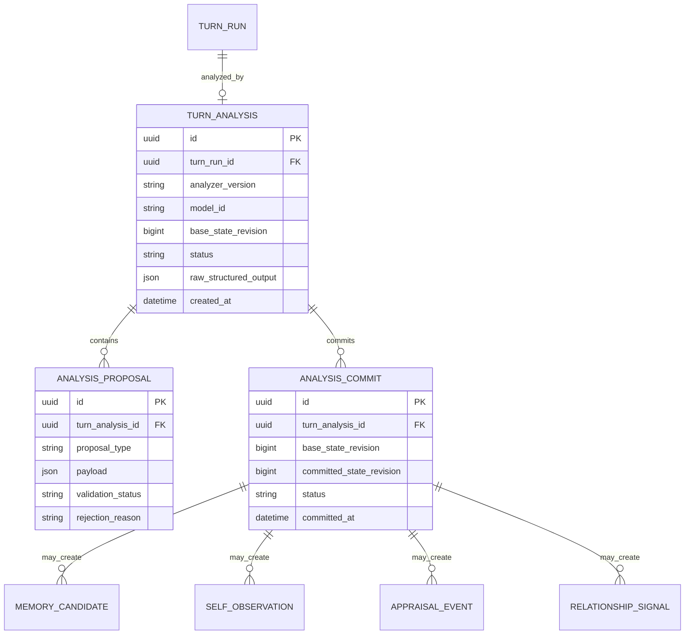

## 3.11 Turn Analyzer v1 / Commit Pipeline（2026-09-26 r5 AI提案）

### Analyzerの責務
一回のpost-turn structured callで、以下の**候補**だけを生成する。DB ID生成、最終confidence、state transition、soft delete、permissionは行わない。

```text
TURN (user + assistant)
   ↓
Turn Analyzer
   ├─ memory_candidates[]
   ├─ self_observations[]
   ├─ appraisal_candidate?
   ├─ emotion_candidate?
   └─ relationship_signals[]
   ↓
Deterministic Validator / Projector
   ↓
Atomic DB Commit
```

### TurnAnalysisV1概念Schema
```json
{
  "schema_version": "turn-analysis-v1",
  "analysis_status": "ok|uncertain",
  "memory_candidates": [
    {
      "kind": "episode|claim",
      "subject_scope": "user|ai|relationship|shared|world",
      "statement": "...",
      "temporal_scope": "past_event|current|persistent|temporary|unknown",
      "explicitness": "direct|inferred",
      "importance": "trivial|low|medium|high|critical",
      "retention_reasons": ["preference|identity|commitment|relationship|future_use|correction|explicit_remember"],
      "relation_to_existing": {
        "action": "new|duplicate|supports|contradicts|corrects|changes_over_time",
        "memory_id": "optional-existing-id"
      },
      "evidence_message_ids": ["allowed-message-id"]
    }
  ],
  "self_observations": [
    {
      "topic": "...",
      "observation": "...",
      "spontaneity": "low|medium|high",
      "user_influence": "low|medium|high",
      "evidence_message_ids": ["allowed-message-id"]
    }
  ],
  "appraisal_candidate": {
    "pleasantness": "strong_negative|negative|neutral|positive|strong_positive",
    "novelty": "low|medium|high",
    "relevance": "low|medium|high",
    "goal_alignment": "negative|neutral|positive",
    "controllability": "low|medium|high",
    "cause_summary": "...",
    "target_type": "..."
  },
  "emotion_candidate": {
    "primary_type": "interest|joy|surprise|frustration|sadness|anxiety|relief|other",
    "intensity": "weak|moderate|strong",
    "action_tendency": "..."
  },
  "relationship_signals": [
    {
      "dimension": "familiarity|trust|comfort|shared_history|interaction_style",
      "direction": "decrease|increase",
      "strength": "weak|moderate|strong",
      "reason": "...",
      "evidence_message_ids": ["allowed-message-id"]
    }
  ]
}
```

実JSON Schemaでは`additionalProperties=false`、配列数上限、文字列長上限、enumを厳しく設定する。`memory_id`と`evidence_message_ids`はAnalyzerへ渡した実在IDだけをdynamic enumとして許可する。新規UUIDや数値confidenceはコード側で生成する。

### Commit pipeline
1. **Schema validation**: constrained decoding + application側schema再検証。
2. **Reference validation**: source Message / existing Memory IDが実在し、Analyzer入力時に許可されたIDか検査。
3. **Forget/visibility validation**: `soft_deleted` Memory、forget対象source、privacy suppression対象を根拠や再生成に使用不可。
4. **Secret filter**: password/API key/auth token等のpattern・entropyベース検知を行いMemory候補をreject/redact。
5. **Duplicate/correction validation**: active Memory shortlistと比較し、duplicateはEvidence追加、correction/change-over-timeは旧Claimを非破壊で更新。ambiguousなら確定更新を避ける。
6. **Weight projection**: ordinal値をcode-owned weightへ変換。Self/Relationshipの1-turn deltaには上限を設ける。
7. **Revision check**: Analyzer開始時の`state_revision`と現在値を比較。競合する変更、特にforget/correction後のstale resultはrejectまたは安全な項目のみrebase。
8. **Atomic transaction**: Candidate/Evidence/Revision/Lifecycle/Domain updateを一つのtransactionでcommit。
9. **Idempotency**: `turn_id + analyzer_version`のcommit済み結果は重複適用しない。

### Scheduler / resource policy
- Application Schedulerが`foreground_dialogue > explicit_command > turn_analyzer > consolidation/reflection`を所有。
- Backendのparallel slotやOS process priorityを正しさの境界にしない。
- Main stream終了後にAnalyzerを開始しても、新しいUser Messageが来たらcancel/defer可能。
- MainとAnalyzerを同GPU常駐させるか、AnalyzerをCPU/iGPU/別GPUへ置くかは実機benchmarkで決める。
- Main serverとAnalyzer workerは論理的に分離し、Analyzer障害/OOMでChat serverを落とさない。

### Analyzer model benchmark候補（採用未決）
- `Qwen3.5-0.8B`: 最軽量baseline。速度/構造化抽出の最低ライン確認用。
- `Qwen3.5-2B`: 第一候補。日本語を含む広いmultilingual coverageを期待でき、2B規模。
- `Qwen3-1.7B`: より成熟したruntime互換性を持つ比較候補。non-thinking modeを利用。
- `Gemma 3 4B`: 小型側が精度不足だった場合のquality baseline。
- `SmolLM3-3B`: 公式native multilingualが6言語で日本語を含まないため、本プロジェクトの第一候補からは外す。

Qwen3.5は2026年時点でllama.cpp support自体は存在するが、backend/変換/長文等に最近のissueもあるため、採用時は固定commit/buildでregression testする。

### Benchmark Harness v1
同一のDB snapshotとturn列をreplayし、少なくとも以下を比較する。

**Runtime profiles**
- A: Main×1 + 同じMainでasync analysis
- B: Main×1 + dedicated small Analyzer×1
- C: optional pre-turn SLM + Main×1 + async Analyzer（高品質比較用）

**Foreground metrics**
- TTFT p50/p95
- E2E p50/p95
- prefill time / decode tok/s or TPOT
- input/output tokens
- VRAM/RAM peak
- Analyzer稼働中のTTFT degradation

**Analyzer metrics**
- Memory save precision / recall
- false-positive Memory rate（特に重視）
- correction vs change-over-time classification
- duplicate detection
- Self/User separation violations
- Relationship signal false positives
- Appraisal/Emotion consistency
- structured-output/schema failure rate
- analyzer queue age / retry rate

**System invariants**
- soft-deleted MemoryがRecall/Analyzer/Promptへ復活しない
- 同じTurnをreplay/retryして二重commitしない
- Analyzer停止中でもChat継続可能
- foreground arrivalでbackgroundが会話を顕著に遅くしない

絶対latency閾値はHardware取得後に設定する。先に相対基準として、Profile B/CはProfile Aに対するTTFT悪化と内部更新精度の改善を同時に比較し、品質改善が小さいのにforeground latency/VRAMが大きく増える構成は採用しない。

### Orchestrator/Analyzer ER addendum


`ANALYSIS_PROPOSAL`はDeveloper Inspectorで「モデルは何を提案し、コードが何を採用/却下したか」を見せるために有用。将来schemaが安定したらdomain tableへ直接stagingする最適化は可能だが、v0.1育成期間はauditabilityを優先する。

---
