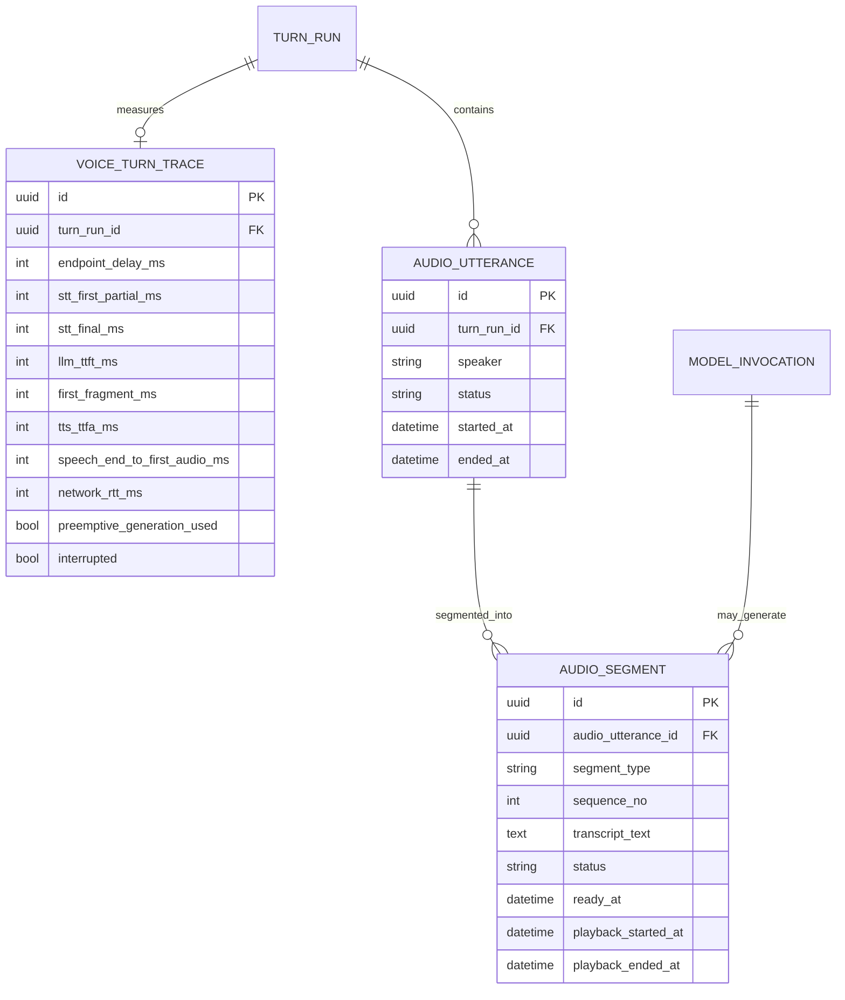

## 3.11 Voice / AI VTuber向け低遅延パイプライン案（r7、後続実装だが設計保持）

AI VTuber/Voiceでは「全工程の完了時間」より、ユーザー発話終了からAIの最初の音声が出るまでの体感latencyを優先する。全完了待ちの直列pipelineは採らない。

```text
MIC AUDIO
   │
   ├── streaming VAD / ASR partial ───────────────────────┐
   │                                                       │
   └── semantic/acoustic Turn Detector                     │
              │                                            │
      probable end-of-turn                                 │
              │                                            │
              ├── optional preemptive Main generation <────┘
              │          │
              │          └── final transcript changed? → cancel/restart
              │
      confirmed user turn
              │
              ▼
       Context Capsule finalize
              │
              ▼
       MAIN LLM STREAM
              │ token stream
              ▼
      Safe Segmenter
  punctuation/phrase boundary
              │
        ┌─────┴─────────────┐
        ▼                   ▼
  first fragment        later fragments
  priority TTS          concurrent TTS
        │                   │
        └────────┬──────────┘
                 ▼
          ordered audio queue
                 │
                 ▼
              PLAYBACK
                 │
       user starts speaking?
                 │ yes
                 ▼
      cancel playback / pending TTS
      cancel/defer generation if useful
```

### 3.11.1 原則
- `STT完了 → LLM全文完了 → TTS全文完了 → 再生` の完全直列は避ける。
- Main LLMはstreaming必須候補。最初の安全なphrase/sentenceが出来た時点でTTSへ渡す。
- 最初のfragmentは短めに優先し、その再生中に後続TTSを並列生成する。
- turn確定前のpreemptive generationはoptional。partial transcript変更時は破棄できることを採用条件とする。
- interruption/barge-in時、長いAI音声を最後まで再生しない。ユーザー発話をforeground P0相当で優先する。
- Avatar/非言語応答は将来、LLM応答前にも使えるが、過大な推論待ちを誤魔化す目的で固定フィラーを濫用しない。
- remote/Colab Mainでも同じinterfaceを使い、ネットワーク往復をlatency traceへ分離記録する。

### 3.11.2 体感Latency Budget（暫定目標、事実値ではなく設計目標）
- Voice user-speech-end → first audible AI audio: `p50 1.0s前後、p95 2.0s以内`を挑戦目標とする。モデル/回線で達成不能なら測定結果から再設定。
- Text chat Main TTFT: `p50 < 1s`を初期目標。
- end-of-turn decisionだけで1秒以上常態的に消費しない。
- background Analyzer / consolidationは上記foreground budgetへ含めず、競合時はcancel/deferする。

### 3.11.3 Low-latency optimization layers
1. Turn detection: VADのみ / STT endpoint / semantic-acoustic detectorを比較。
2. ASR: streaming partial transcript、言語固定可能時はauto language detectionを避ける比較。
3. Main inference: preload/warmup、prompt cache、KV reuse、speculative decodingを個別benchmark。
4. Output segmentation: first speakable fragmentを早く確定し、極端に短い断片や意味の壊れた読み上げは避ける。
5. TTS: first-fragment priority、segment並列合成、audio chunk streaming。
6. Scheduling: Main/Voice foregroundをP0、Analyzer/Reflectionを後回し。
7. Network: Colab/remote利用時はRTT・upload・queue・TTFTを分離し、GPU高速化がnetwork overheadを上回る場合だけ通常会話へ採用。
8. Interruption: user speechを検知したらplaybackとpending synthesisを止め、Conversation stateへ「聞こえた/聞こえなかった範囲」を残す。

### 3.11.4 Voice latency conceptual ER addendum


これは将来Voice実装用の概念ERであり、v0.1 text-onlyコアERを置換しない。
