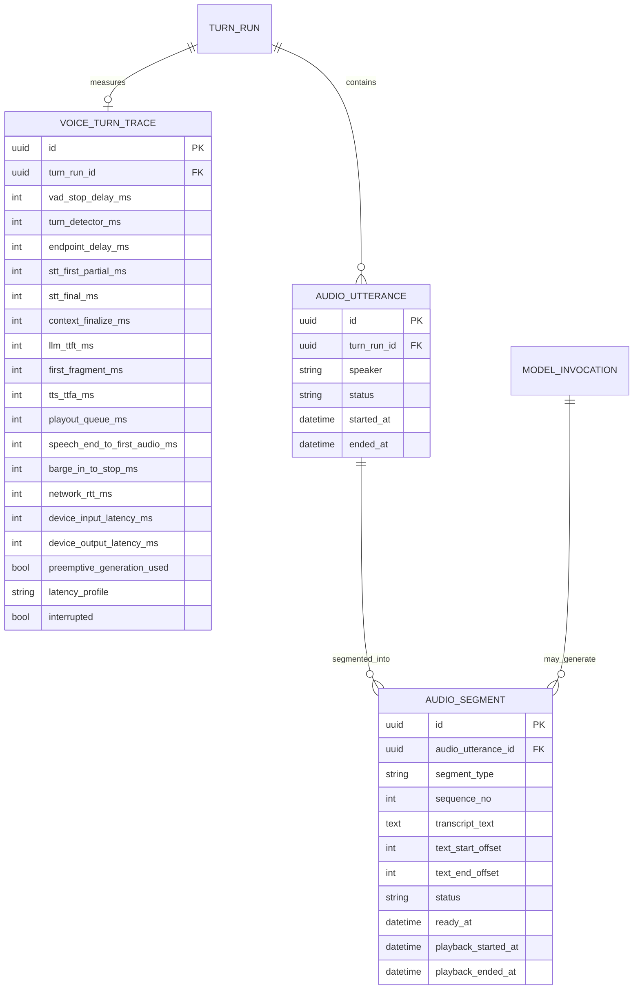

## 3.13 End-to-end Conversation Latency Budget / 0ms Timeline（r8 AI提案）

### 3.13.1 設計思想
人間会話のturn間gapは代表的研究で約200ms程度とされ、発話生成そのものにはそれ以上の時間が必要なため、人間も相手が話し終わる前から応答準備していると考えられている。本AIも「発話終了後に全部開始」ではなく、**ユーザーが話している時間をprecompute時間として使う**。

AIVTuber/Voiceで目指すのは単純な高tok/sではなく、以下の重複実行:

```text
USER SPEAKING
 │
 ├─ AEC / VAD
 ├─ streaming ASR partial
 ├─ cheap lexical/context prefetch
 └─ debounced semantic recall prefetch
        ↓
LAST USER AUDIO SAMPLE = T0
 │
 ├─ turn completion判定
 ├─ final transcript / final recall確定
 └─ Balanced profileではfinal transcript到着時点でMainをpreemptive start
        ↓
MAIN first token
        ↓
first speakable fragment
        ↓
TTS first PCM
        ↓
FIRST BOT PLAYOUT SAMPLE
```

partial transcriptは**provisional**。検索/prefetchには使えるが、Memory/Self/User/Relationship更新やshared-history確定には使わない。

### 3.13.2 Turn detection候補
- 単純VADだけでは「息継ぎ」と「turn終了」を区別できないため、VAD後にaudio/semantic turn detectorを置く案を第一候補とする。
- Pipecat Smart Turn v3系は日本語を含む複数言語を扱い、local CPU向けsmall modelとして提供されている。LiveKitにも日本語対応audio turn detectorとdynamic endpointingがある。
- v0.1 Voice実装時は `VAD only / Smart Turn local / LiveKit-style audio detector` を同一音声datasetで比較する。

### 3.13.3 Balanced profileの0ms timeline（設計目標、実測値ではない）
`T0 = userの最後の実音声sample` とする。以下の数値は**budget/target**であり、hardware/networkを測る前の性能保証ではない。

| 時点 | 処理 | 目標/考え方 |
|---:|---|---|
| T0以前 | AEC/VAD/ASR partial | 常時stream。Recall候補を先読み |
| T0 + 0〜200ms | silence candidate | 短いVAD stop候補。誤切断防止のため即commitしない |
| T0 + 約200〜350ms | Smart turn判定/commit候補 | local turn modelを短時間で走らせる。会話スタイルに応じdynamic調整 |
| 同時進行 | final ASR / Context finalize | partialで準備済みの候補をfinal transcriptで検証・確定 |
| turn確定前から可 | Main preemptive request | Balancedでは**final transcriptが来たら**Main開始。ユーザー再開時はcancel |
| Main first token後 | Safe Segmenter | 最初の自然なphraseをなるべく早く確定 |
| fragment確定後 | TTS first-fragment priority | 後続segmentより先に合成/再生 |
| T0 + ~1s目標 | First bot audio | Project target: p50 ≈1s、p95 ≤2sを維持。実機で再設定 |

人間の約200ms gapをそのままSLAにするのではなく、**200msに近づくために先読みを使う**という設計根拠として扱う。

### 3.13.4 Safe / Balanced / Aggressive profiles
| Profile | Main開始 | TTS開始 | 特徴 |
|---|---|---|---|
| Safe | semantic turn確定後 | first fragment後 | 無駄生成最小。latency最大 |
| **Balanced (既定候補)** | STT final到着後、turn確定前でも開始 | turn確定後 | LLM TTFTをendpointing待ちに隠す。再開時cancel |
| Aggressive | stable partial transcriptから投機開始 | 任意でpreemptive TTSも可 | 最速候補だが誤予測/compute waste/誤発話リスク高。実験用 |

Aggressiveを既定にしない。partial textでMainを開始しても、その生成物をcanonical conversationやMemoryへcommitしない。

### 3.13.5 Cache-friendly Prompt Topology
毎turn変わるMemory/Moodをsystem prompt先頭へ挿入すると共通prefixが壊れやすいため、次を第一候補にする。

```text
[STABLE PREFIX]
 Hard rules
 Identity Kernel
 stable persona contract

[SESSION PREFIX]
 committed/delivered conversation history through previous turn

[DYNAMIC TURN CONTEXT]
 Current Mood / AI_STATE
 Relevant Self/User/Relationship
 Retrieved Memory evidence
 Current user message
```

- stable/session prefixを極力保持し、dynamic contextを後段へ置く。
- llama.cpp系では`cache_prompt`により共通prefix KV再利用が可能で、`n_predict=0`でpromptだけをcacheへprefillする経路もある。runtimeごとに有効性をbenchmarkする。
- Turn終了後、次turnまでのidle時間に`stable + committed session prefix`をwarm-prefillする**Warm Prefix Mirror**をlocal/remoteとも試す。
- Cacheはephemeral acceleration。cacheが消えてもAI stateはDBから復元可能でなければならない。

### 3.13.6 Retrieval prefetch during speech
partial ASR更新ごとに重いEmbeddingを乱発しない。

```text
partial transcript
  ↓
cheap lexical/keyword prefetch      [frequent]
  ↓
stable partial + debounce
  ↓
semantic embedding prefetch         [limited]
  ↓
final transcript
  ↓
final rank/fusion + visibility check
```

さらに直前turnで使ったMemory ID/embedding/queryを短TTLの`Hot Context Cache`として再利用し、「それ」「さっきのやつ」等のfollow-upで毎回全検索し直さない。これはcanonical Memoryではなく消えてよいcache。

### 3.13.7 Local Main vs Colab Main
**Local Main**
- network hopなし。
- prompt/KV cache、warm process、speculative decoding等を最大限利用しやすい。
- ASR/TTS/AnalyzerとのGPU/CPU競合が主なリスク。

**Colab/Remote Main**
- Local側でVAD/ASR/Recall/Context preparationを済ませ、remoteへは必要最小限のContext Capsuleを送る。
- persistent connection + warm model + prefix cacheを前提候補とする。
- GPU速度が速くてもnetwork RTT/remote queue/cold sessionで全体SLAを外すならVoice既定backendにはしない。
- Colab採用可否は`user-speech-end → first bot audio`のend-to-end値で判断し、単独tok/sで採用しない。

### 3.13.8 Resource isolation / queue policy
Voiceでは以下の順に守る。

```text
P0 Audio capture / AEC / VAD / Turn detector / playback
P0 Main Dialogue request + stream
P1 TTS first fragment
P1 later TTS (bounded concurrency)
P2 Recall finalization / embedding
P3 Turn Analyzer
P4 Reflection / Consolidation / Archive review
```

- Audio threadからDB/LLM blocking callを直接呼ばない。
- MainとAnalyzerが同一GPUならMain到着時にAnalyzerをpause/cancel可能にする。
- TTS並列数は無制限にせず、CPU/GPU競合とplayback bufferを監視する。
- speech bufferは数秒先程度のbounded lookaheadを目標に調整し、ユーザーが割り込んだ後まで大量合成しない。

### 3.13.9 Barge-in / AEC / delivery truth
Speaker出力をMicが拾うとVAD/ASR/interrupt detectorを壊すため、speakersでfull-duplex/bargingを行う場合AECを重要要件とする。headphonesでもinterruption pipeline自体は同じ。

barge-in時:
1. incoming user speechを検知。
2. true interruptionかbackchannelかを可能なら判定。
3. playbackを停止。
4. pending TTS/audio segmentをcancel。
5. 必要ならMain generationもcancel/defer。
6. **実際に再生済みのassistant textだけ**をcanonical `MESSAGE.content`として確定。
7. 未再生tailはdeveloper traceへ保持可能だが、Memory/Relationship/Promise evidenceに使わない。

これにより「生成はしたが相手には言っていないこと」を共有経験として捏造しない。

### 3.13.10 Latency measurement truth
framework内timestampだけではなく、可能な限りraw audioの同一clock計測を追加する。

最低限記録:
- `user_last_audio_sample_at`
- `vad_silence_candidate_at`
- `turn_detector_started_at / completed_at`
- `turn_committed_at`
- `stt_first_partial_at / stt_final_at`
- `context_ready_at`
- `llm_request_at / llm_first_token_at`
- `first_fragment_ready_at`
- `tts_request_at / first_pcm_ready_at`
- `playback_started_at`
- `barge_in_detected_at / playback_stopped_at`
- input/output device latency estimate（取得可能な場合）

主要KPI:
- **perceived response gap** = last real user audio → first real bot playout audio
- **barge-in stop latency** = user interruption onset → bot audio actually stops
- p50 / p90 / p95 / p99を保存する。

### 3.13.11 Voice trace ER update


### 3.13.12 Benchmark gates before Voice backend adoption
- `LOCAL_ONLY`、`HYBRID_COLAB_MAIN`を同一音声scenarioで比較。
- normal turn / long user turn / short follow-up / correction / barge-in / backchannel / noisy roomを含める。
- Main modelだけでなく、AEC/VAD/turn detector/ASR/TTS/audio deviceを含むend-to-endで測る。
- Bluetoothは追加device latencyを持ち得るため、性能基準benchmarkは有線または既知deviceで行い、Bluetoothは別profileとして記録する。
- Remote backendは品質が高くてもVoice p95 SLAを常態的に外すなら、Text/high-quality mode限定へ落とす。
