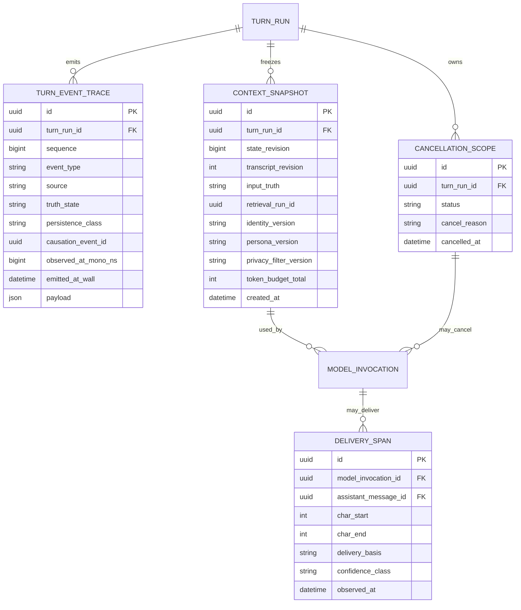

## 3.14 Orchestrator Event / Command / Snapshot 型契約（r9 AI提案）

### 3.14.1 方針
この節は**実コードではなく、Codex実装前 / 非コード仕様の過剰詳細化を抑制に固定する型・境界契約**である。実装言語やframeworkに依存しない。

3種類を分離する。

- **Command**: 「何かをしてほしい」という処理要求。成功するとは限らずcancel可能。
- **Event**: 「すでに何かが起きた」という不変の事実。再実行命令ではない。
- **Snapshot**: あるrevision時点の入力/状態を凍結した読み取り専用データ。

Main Dialogue、ASR、Recall、TTS、Remote Gateway等はこの契約を介し、Domain DB Entityを直接相互mutationしない。

### 3.14.2 共通 Event Envelope

| Field | Type | Required | 意味 |
|---|---|---:|---|
| `schema_version` | string | yes | event schema version。例 `orch-event-v1` |
| `event_id` | UUID | yes | Event一意ID |
| `event_type` | enum/string | yes | 下記Event種別 |
| `conversation_id` | UUID | yes | 会話単位 |
| `turn_run_id` | UUID | yes | 1 user turn → assistant responseの処理単位 |
| `source` | enum | yes | `ui/audio_capture/vad/asr/turn_detector/retrieval/orchestrator/model_gateway/main_llm/segmenter/tts/playback/analyzer/validator` |
| `sequence` | uint64 | yes | **local Orchestratorが付与**するturn内単調増加番号 |
| `causation_event_id` | UUID nullable | no | このEventを直接引き起こしたEvent |
| `correlation_id` | UUID | yes | 複数componentを跨ぐ処理追跡ID。通常は`turn_run_id`またはsub-operation ID |
| `observed_at_mono_ns` | int64 | yes | local processで観測したmonotonic時刻。latency順序の権威 |
| `emitted_at_wall` | datetime | yes | 人間向けwall-clock時刻 |
| `truth_state` | enum | yes | `provisional / committed / observed` |
| `persistence_class` | enum | yes | `canonical_audit / metric_trace / ephemeral_stream` |
| `payload` | typed object | yes | event_type固有payload |

Remote providerの時計やsequenceは参考情報としてpayloadへ保持可能だが、**Coreでの順序判定には使わない**。

### 3.14.3 TurnRunの直交状態
単一の巨大state enumではなく、独立して進行できる4 phaseを持つ。Voiceではuser発話中にgenerationを投機開始できるため、直列state machineだけでは表現不足になる。

| Phase | States |
|---|---|
| `input_phase` | `collecting / endpoint_candidate / committed` |
| `generation_phase` | `idle / prefetching / generating_provisional / generating_committed / completed / cancelled / failed` |
| `delivery_phase` | `idle / buffering / playing / completed / interrupted / cancelled / failed` |
| `analysis_phase` | `not_started / queued / running / validated / committed / failed / deferred` |

不変条件:
- `input_phase=committed`後のUser Message本文は同じturn内で書換えない。後続のbarge-inは新しいturn。
- `provisional generation`はdelivery/canonical Memory根拠にならない。
- `analysis_phase`はforeground completionを阻害しない。

### 3.14.4 Input / ASR Event types

#### `UserSpeechStarted`
- `utterance_id: UUID`
- `audio_stream_id: UUID`
- `onset_mono_ns: int64`
- `is_barge_in_candidate: bool`

意味: 実ユーザー音声らしい発話開始を検知。まだ内容やinterrupt確定を意味しない。

#### `TranscriptUpdated`
- `utterance_id: UUID`
- `revision: uint32`
- `text: string`
- `stage: provisional | stable_partial | final`
- `audio_start_ms: int32`
- `audio_end_ms: int32`
- `language: string nullable`
- `confidence_class: low | medium | high | unknown`

規則: `revision`は同一utterance内で増加。`provisional/stable_partial`は検索prefetchに利用可だがDomain State更新は禁止。

#### `UserEndpointCandidate`
- `utterance_id: UUID`
- `reason: silence | semantic_turn | asr_endpoint | manual_submit`
- `confidence_class: low | medium | high`
- `last_audio_sample_mono_ns: int64`

#### `UserTurnCommitted`
- `utterance_id: UUID nullable`（text inputならnull可）
- `message_id: UUID`
- `transcript_revision: uint32 nullable`
- `text: string`
- `commit_reason: semantic_turn | manual_submit | text_submit | timeout_fallback`
- `last_user_audio_sample_mono_ns: int64 nullable`

これが**canonical user inputの境界**。Memory/Turn Analyzer等は原則ここ以後のみ確定処理可能。

### 3.14.5 Retrieval / Context Snapshot types

#### `RecallSnapshot`
- `retrieval_run_id: UUID`
- `query_revision: uint32`
- `stage: prefetch | final`
- `memory_refs: MemoryRecallRef[]`
- `raw_message_refs: RawConversationRef[]`
- `created_from_transcript_stage: provisional | stable_partial | final | committed`

`MemoryRecallRef`:
- `memory_item_id: UUID`
- `memory_kind: episode | claim | ...`
- `summary: string`
- `rank: uint16`
- `score_band: weak | medium | strong`
- `provenance_message_ids: UUID[]`
- `visibility_state: active | archived`（soft_deletedは禁止）

#### `ContextCapsule` (immutable Snapshot)
- `context_snapshot_id: UUID`
- `turn_run_id: UUID`
- `state_revision: uint64`
- `user_input_message_id: UUID nullable`
- `transcript_revision: uint32 nullable`
- `input_truth: provisional | committed`
- `identity_version: string`
- `persona_version: string`
- `ai_state_snapshot: typed summary`
- `mood_snapshot: typed summary`
- `self_items: SelfContextItem[]`
- `user_items: UserContextItem[]`
- `relationship_snapshot: RelationshipContext`
- `memory_items: MemoryContextItem[]`
- `recent_messages: MessageContextItem[]`
- `retrieval_run_id: UUID nullable`
- `token_budget: TokenBudget`
- `privacy_filter_version: string`
- `remote_safe: bool`
- `created_at: datetime`

一度generationへ渡した`ContextCapsule`はmutationしない。新しい状態が必要なら新snapshotを作る。

### 3.14.6 Main Generation Command / Event types

#### Command `StartGeneration`
- `generation_id: UUID`
- `turn_run_id: UUID`
- `context_snapshot_id: UUID`
- `mode: provisional | committed`
- `model_role: dialogue`
- `cancellation_scope_id: UUID`
- `output_policy: text_stream | voice_stream_ready`

#### Events
`GenerationStarted`:
- `generation_id`
- `provider_session_id`
- `model_id`
- `context_snapshot_id`

`GenerationFirstToken`:
- `generation_id`
- `token_index = 0`
- `text_delta`

`GenerationTextDelta` (ephemeral):
- `generation_id`
- `delta_index`
- `text_delta`
- `cumulative_char_end`

`GenerationCompleted`:
- `generation_id`
- `full_generated_text`
- `finish_reason: stop | length | tool_boundary | cancelled_after_output | error`
- `input_tokens`
- `output_tokens`

`GenerationCancelled`:
- `generation_id`
- `reason: user_resumed | barge_in | superseded_input | foreground_priority | timeout | provider_disconnect | manual`
- `generated_char_count_before_cancel`

### 3.14.7 Speakable Fragment / TTS types

#### `SpeakableFragmentReady`
- `fragment_id: UUID`
- `generation_id: UUID`
- `ordinal: uint16`
- `text: string`
- `generation_char_start: uint32`
- `generation_char_end: uint32`
- `boundary_type: sentence | clause | semantic_safe | forced_latency`
- `can_release_before_generation_complete: bool`
- `source_truth: provisional | committed`

`source_truth=provisional`はBalanced既定ではTTS/playbackへreleaseしない。

#### Command `SynthesizeSpeechSegment`
- `tts_job_id: UUID`
- `fragment_id: UUID`
- `voice_profile_version: string`
- `priority: first_fragment | normal`
- `cancellation_scope_id: UUID`

#### `SpeechSegmentReady`
- `tts_job_id`
- `audio_segment_id`
- `fragment_id`
- `duration_ms`
- `alignment_ref: UUID nullable`

### 3.14.8 Playback / Delivery Truth types

#### `PlaybackStarted`
- `playback_session_id: UUID`
- `audio_segment_id: UUID`
- `fragment_id: UUID`
- `started_mono_ns: int64`

#### `AssistantDeliveryCheckpoint`
- `playback_session_id: UUID`
- `generation_id: UUID`
- `fragment_id: UUID`
- `generation_char_start: uint32`
- `generation_char_end_delivered: uint32`
- `delivery_basis: tts_alignment | completed_fragment | conservative_estimate | ui_rendered`
- `confidence_class: low | medium | high`
- `observed_mono_ns: int64`

このEventが**Voiceのcanonical assistant contentの根拠**になる。完全fragment再生しか追跡できないTTSでは`completed_fragment`を使い、alignment対応時はより細かいspanを進める。

#### `AssistantDeliveryCompleted`
- `generation_id`
- `assistant_message_id`
- `canonical_delivered_text`
- `delivery_status: complete | interrupted | partial | text_only`

Text Chatでは送信表示されたtext全体を即delivery済みとして扱えるため同じ型を簡略利用する。

### 3.14.9 Barge-in / Cancellation types

#### `BargeInDetected`
- `new_utterance_id: UUID`
- `playback_session_id: UUID`
- `onset_mono_ns: int64`
- `classification: candidate_interrupt | likely_backchannel | confirmed_interrupt`
- `confidence_class: low | medium | high`

#### `InterruptionDecision`
- `decision: continue | duck | interrupt`
- `reason: backchannel | semantic_interrupt | sustained_speech | explicit_stop | unknown`
- `target_playback_session_id`
- `target_generation_id nullable`

#### Command `CancelScope`
- `cancellation_scope_id: UUID`
- `reason`（上記GenerationCancelled reasonと共通enum）
- `cancel_generation: bool`
- `cancel_pending_tts: bool`
- `stop_playback: bool`

規則:
- 同じ`CancelScope`を複数回発行しても結果は同じ（idempotent）。
- cancel済みscopeに属する後着`SpeechSegmentReady`等はOrchestratorがdiscardする。

### 3.14.10 Background Analysis types

#### Command `AnalyzeCommittedTurn`
- `turn_run_id`
- `canonical_user_message_id`
- `canonical_assistant_message_id nullable`
- `assistant_delivery_status`
- `base_state_revision`
- `analyzer_version`

規則: Analyzerへ渡すassistant本文は**delivery済みcanonical textのみ**。

既存`TURN_ANALYSIS / ANALYSIS_PROPOSAL / ANALYSIS_COMMIT`へ接続し、未delivery tailをproposal evidenceへ含めない。

### 3.14.11 Queue / Backpressure契約

| Stream | Queue policy | Drop/Cancel rule |
|---|---|---|
| Mic audio | tiny realtime ring buffer | 遅れたbufferを大量蓄積しない。audio threadをblockしない |
| ASR partial | latest-wins | 古いpartial revisionはdrop可 |
| Token delta | ordered bounded | UI/TTSが遅い場合はdeltaをcoalesce可。順序は保持 |
| Speakable fragment | ordered bounded | cancel scope発火後は未再生fragment破棄 |
| TTS jobs | bounded priority queue | first fragment優先、遠い未来segmentは生成しない |
| Playback | ordered minimal buffer | barge-inで即flush可能 |
| Turn Analyzer | durable low-priority queue | foreground到着時defer可。turn IDでretry |
| Reflection | batch/idle queue | いつでもdefer可 |

### 3.14.12 Persistence Classes

**`canonical_audit` 永続化**
- `UserTurnCommitted`
- `AssistantDeliveryCompleted`
- confirmed interruption / cancellation reason
- Context Snapshot metadata（全文payloadはpolicyで制御）
- Generation summary (`model/version/tokens/timing/status`)
- Turn Analysis commit結果

**`metric_trace` 原則永続/集約**
- first token / first fragment / first PCM / playback start timestamps
- endpointing / turn detector timing
- queue delay / cancel latency

**`ephemeral_stream` 既定では非永続**
- raw mic audio chunks
- 全ASR partial revisions
- token-by-token delta
- PCM chunks

Developer debug modeで短期保持する場合もretentionを明示する。

### 3.14.13 Text v0.1で使うsubset
Voice未実装でも以下の型を先に使う。

```text
TextSubmit
   ↓
UserTurnCommitted
   ↓
RecallSnapshot(final)
   ↓
ContextCapsule(committed)
   ↓
StartGeneration
   ↓
GenerationStarted / TextDelta / Completed
   ↓
AssistantDeliveryCompleted(text_only)
   ↓
AnalyzeCommittedTurn
```

これにより将来Voice化してもDomain側のMemory/Self/User/Relationship更新契約を変更せず、Input/Delivery部分だけstream化できる。

### 3.14.14 型レベルの受入条件
1. すべてのEventが`turn_run_id + sequence`で完全順序を復元できる。
2. provisional transcript/generationだけでは`MESSAGE`, Memory, Self, User, Relationshipを確定更新できない。
3. 同じcancelを2回適用しても副作用が二重化しない。
4. cancel後に遅れて届いたRemote token/TTS segmentを再生しない。
5. ContextCapsule生成後にDB stateが変化しても、そのgenerationの入力根拠はsnapshotとして再現できる。
6. barge-in時、Turn Analyzerが未delivery tailを学習しない。
7. Text modeとVoice modeが同じ`UserTurnCommitted → ContextCapsule → Generation → AssistantDeliveryCompleted → AnalyzeCommittedTurn`骨格を共有する。
8. Remote/Colab MainをLocal Mainへ交換してもCore側Event型は変更不要。

### 3.14.15 Technical trace ER addendum


これはDomain ERを置換せず、**Orchestrator/Developer Trace用の技術ER**として追加する。
