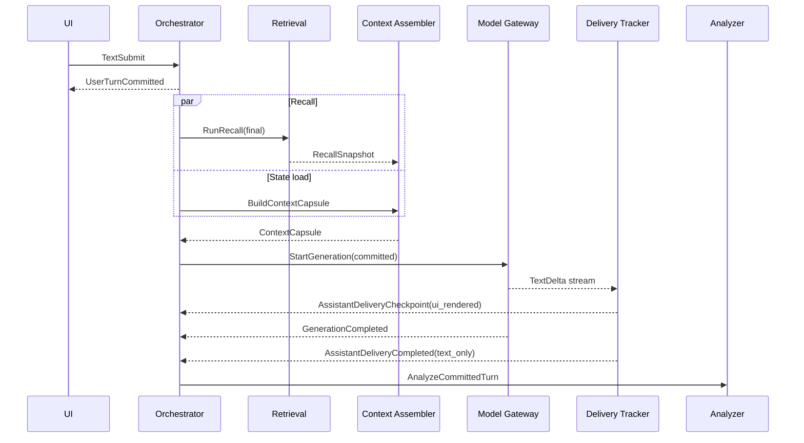
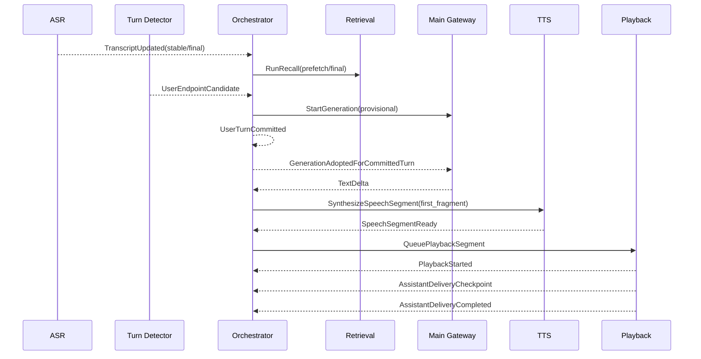
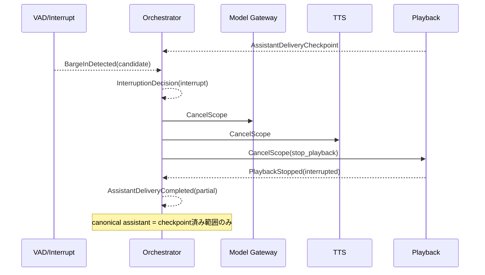
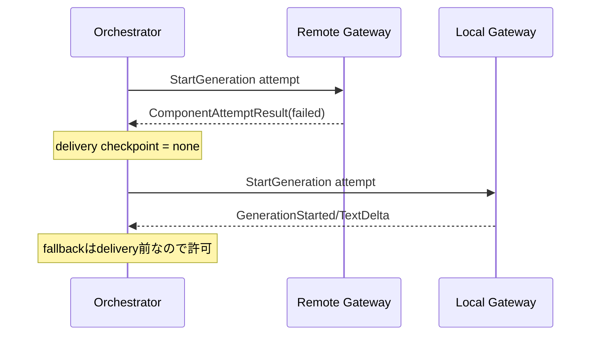
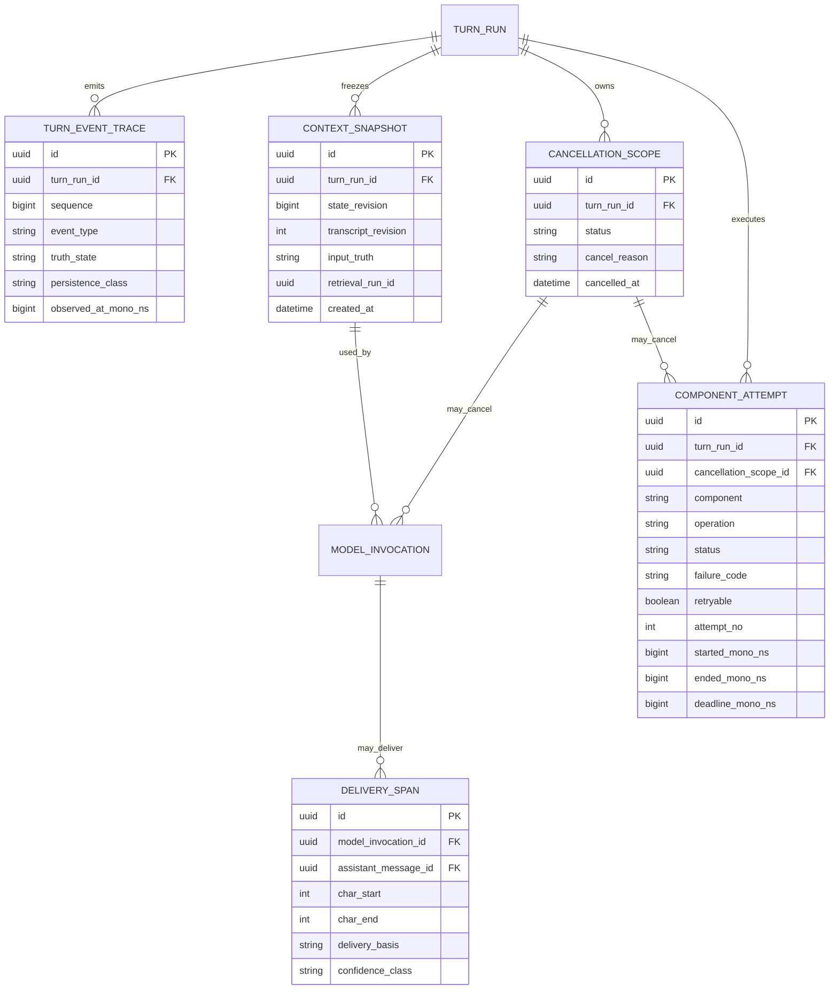

## 3.15 Producer / Consumer・状態遷移・Failure/Cancel契約（r10 AI提案）

### 3.15.1 Component ownership
Canonical stateのwriterを一意にする。各componentはEventを発行できるが、他componentの所有stateを直接mutationしない。

| Ownership | 唯一のowner | 他componentがしてよいこと | 禁止 |
|---|---|---|---|
| TurnRun phase / turn内`sequence` / cancellation registry | Local Orchestrator | Event/Commandを送る | remote/providerがturn stateを直接変更 |
| canonical User/Assistant Message | Message/Delivery projection | committed/delivery Eventを材料にproposal | ASR/LLMがMESSAGEを直接確定 |
| ContextCapsule | Context Assembler | snapshot作成要求、参照 | 生成開始後のin-place mutation |
| Retrieval結果 | Retrieval Service | RecallSnapshotを発行 | Memory Entity自体のmutation |
| normalized generation stream | Model Gateway | provider固有streamを正規化 | provider eventをCoreへ直通 |
| delivery truth | Delivery Tracker（TextではUI delivery adapter、Voiceではplayback/alignment tracker） | delivery checkpointを発行 | generated text全量を自動でcanonical化 |
| Memory/Self/User/Relationship/Affect確定更新 | Validator + Projector + Domain State Store | Analyzerはproposal作成のみ | Analyzer/LLMがDB Entityへ直接書込 |
| Trace/metrics | Trace Sink | Event/Attemptを記録 | trace結果からdomain stateを逆mutation |

### 3.15.2 Command producer / consumer

| Command | Producer | Required consumer | 成功時の主要Event | 備考 |
|---|---|---|---|---|
| `RunRecall` | Orchestrator | Retrieval Service | `RecallSnapshot` | `prefetch/final`を指定。soft_deletedは入力段階で除外 |
| `BuildContextCapsule` | Orchestrator | Context Assembler | Context Snapshot作成完了Event/参照 | state/transcript/retrieval revisionを固定 |
| `StartGeneration` | Orchestrator | Model Gateway | `GenerationStarted/FirstToken/TextDelta/...` | provider差はGateway内に閉じる |
| `SynthesizeSpeechSegment` | Orchestrator/Segmenter | TTS | `SpeechSegmentReady` | first-fragment priorityを持つ |
| `QueuePlaybackSegment` | Orchestrator | Playback | `PlaybackStarted` / `PlaybackStopped` | ordinalを守り、cancel scopeを検査 |
| `CancelScope` | Orchestrator | Model Gateway / TTS / Playback / pending queues | `GenerationCancelled` / component result | idempotent。cancel後late resultはdiscard |
| `AnalyzeCommittedTurn` | Analyzer Scheduler | Turn Analyzer | `TURN_ANALYSIS` proposals | delivery truth確定後のみ |
| `CommitAnalysisProposals` | Validator | Projector/Domain State Store | `ANALYSIS_COMMIT` | current state revisionで再検証後transaction commit |

型補足:
- `RunRecall`: `retrieval_run_id`, `query_text`, `query_revision`, `stage(prefetch|final)`, `deadline_mono_ns`, `visibility_policy_version`。
- `BuildContextCapsule`: `context_snapshot_id`, `turn_run_id`, `input_truth`, `state_revision`, `transcript_revision`, `retrieval_run_id`, `token_budget_profile`。
- `QueuePlaybackSegment`: `playback_session_id`, `audio_segment_id`, `fragment_id`, `ordinal`, `cancellation_scope_id`。

### 3.15.3 Event producer / consumer matrix

| Event | Producer | Required consumer | Optional consumer | Canonical mutation可否 |
|---|---|---|---|---|
| `UserSpeechStarted` | Audio/VAD | Orchestrator, ASR | Interruption classifier, Metrics | No |
| `TranscriptUpdated` | ASR | Orchestrator | Retrieval(prefetch), Turn Detector, Metrics | No |
| `UserEndpointCandidate` | Turn Detector | Orchestrator | preemptive policy | No |
| `UserEndpointRevoked` | Turn Detector/Orchestrator | Orchestrator | Model Gateway(cancel provisional), Retrieval | No |
| `UserTurnCommitted` | Orchestrator | Message projection, Retrieval(final), Context Assembler | Metrics | **User MessageのみYes** |
| `RecallSnapshot` | Retrieval | Context Assembler, Orchestrator | Inspector/Metrics | No |
| `GenerationStarted/FirstToken/TextDelta` | Model Gateway | Orchestrator | UI, Segmenter, Metrics | No |
| `GenerationAdoptedForCommittedTurn` | Orchestrator | Segmenter/Delivery gate | Metrics | No |
| `GenerationCompleted/Cancelled` | Model Gateway | Orchestrator | UI, Metrics | No |
| `SpeakableFragmentReady` | Segmenter | Orchestrator/TTS gate | Metrics | No |
| `SpeechSegmentReady` | TTS | Orchestrator/Playback | Metrics | No |
| `PlaybackStarted` | Playback | Delivery Tracker, Orchestrator | Metrics | No |
| `AssistantDeliveryCheckpoint` | Delivery Tracker / UI adapter | Orchestrator, Message projection | Metrics | **delivered spanのみYes** |
| `PlaybackStopped` | Playback | Orchestrator, Delivery Tracker | Metrics | No |
| `AssistantDeliveryCompleted` | Delivery Tracker/Orchestrator | Message projection, Analyzer Scheduler | UI, Metrics | **Assistant Message確定** |
| `BargeInDetected` | VAD/Interruption classifier | Orchestrator | Metrics | No |
| `InterruptionDecision` | Orchestrator/Interrupt policy | Cancel/Playback policy | Metrics | No |
| `ComponentAttemptResult` | 各component wrapper | Trace Sink, Orchestrator | Inspector | No |
| `ANALYSIS_PROPOSAL` | Turn Analyzer | Validator | Inspector | No |
| `ANALYSIS_COMMIT` | Projector/State Store | Trace/Inspector | - | **Domain transactionのみYes** |

### 3.15.4 r10で追加するEvent型

#### `UserEndpointRevoked`
- `utterance_id: UUID`
- `candidate_event_id: UUID`
- `reason: speech_resumed | semantic_incomplete | asr_continuation | manual_cancel`
- `observed_mono_ns: int64`

意味: endpoint候補を撤回し、`input_phase: endpoint_candidate → collecting`へ戻す。既に走らせたprovisional generationは必要に応じてcancelする。

#### `GenerationAdoptedForCommittedTurn`
- `generation_id: UUID`
- `context_snapshot_id: UUID`
- `committed_user_message_id: UUID`
- `committed_transcript_revision: uint32 nullable`
- `decision_basis: exact_input_match | exact_final_revision_match`
- `state_revision_still_valid: bool`
- `retrieval_revision_still_valid: bool`

規則: Balanced/Aggressiveでcommit前に開始したgenerationをそのままdeliveryへ使えるのは、**committed inputがsnapshotと一致し、cancel/supersedeされていない場合のみ**。不一致なら採用せずcancelし、新しいcommitted generationを開始する。

#### `PlaybackStopped`
- `playback_session_id: UUID`
- `reason: completed | interrupted | cancelled | device_error`
- `stopped_mono_ns: int64`
- `last_delivery_checkpoint_event_id: UUID nullable`

#### `ComponentAttemptResult`
- `attempt_id: UUID`
- `component: audio_capture | vad | asr | turn_detector | retrieval | context_assembler | model_gateway | main_llm | segmenter | tts | playback | analyzer | validator | state_store`
- `operation: string`
- `status: completed | degraded | cancelled | failed | timeout | discarded_late`
- `failure_code: string nullable`
- `retryable: bool`
- `started_mono_ns: int64`
- `ended_mono_ns: int64`
- `deadline_mono_ns: int64 nullable`
- `cancellation_scope_id: UUID nullable`
- `attempt_no: uint16`

同じ処理のretryは同じattemptを上書きせず、新しい`attempt_id / attempt_no`を作る。

### 3.15.5 State transition specification

#### Input phase
| From | Event/Guard | To | Action |
|---|---|---|---|
| `collecting` | high enough `UserEndpointCandidate` | `endpoint_candidate` | final ASR/semantic endpointを待つ。Balancedではpreemptive Main開始可 |
| `endpoint_candidate` | `UserEndpointRevoked` | `collecting` | provisional generationがinput mismatchならcancel |
| `collecting` | text `manual_submit` | `committed` | `UserTurnCommitted`発行 |
| `endpoint_candidate` | commit条件成立 | `committed` | canonical User Message確定 |
| `committed` | 新しいユーザー発話 | **new TurnRun** | 同一turnを書換えない |

#### Generation phase
| From | Event/Guard | To | Action |
|---|---|---|---|
| `idle` | optional prefetch | `prefetching` | cache/retrieval準備のみ |
| `idle/prefetching` | `StartGeneration(mode=provisional)` | `generating_provisional` | delivery gateは閉じる |
| `idle/prefetching` | `StartGeneration(mode=committed)` | `generating_committed` | normal stream |
| `generating_provisional` | `GenerationAdoptedForCommittedTurn` | `generating_committed` | 同じgenerationをdelivery可能にする |
| `generating_provisional` | input revocation/mismatch | `cancelled` | CancelScope伝播。必要ならcommitted generationを新規開始 |
| `generating_committed` | `GenerationCompleted` | `completed` | 残fragmentをflush |
| `generating_*` | cancel | `cancelled` | late deltaをdiscard |
| `generating_*` | provider failure | `failed` | delivery前ならfallback可、delivery後はsilent model switch禁止 |

#### Delivery phase
| From | Event/Guard | To | Action |
|---|---|---|---|
| `idle` | authorized text/audio queued | `buffering` | bounded queueへ |
| `buffering` | first UI render / `PlaybackStarted` | `playing` | delivery checkpoints開始 |
| `playing` | full delivery | `completed` | canonical assistant messageをcomplete確定 |
| `playing` | confirmed barge-in | `interrupted` | delivered spanだけ確定、pendingをflush |
| `buffering/playing` | explicit cancel | `cancelled` | checkpointまでを保持 |
| `buffering/playing` | device/UI delivery failure | `failed` | checkpoint済み範囲だけcanonical |

#### Analysis phase
| From | Event/Guard | To | Action |
|---|---|---|---|
| `not_started` | assistant delivery terminal or user-only terminal | `queued` | `AnalyzeCommittedTurn` enqueue |
| `queued` | scheduler slot | `running` | low-priority execution |
| `queued/running` | foreground priority | `deferred` | safely stop/defer。Domain mutationなし |
| `deferred` | idle | `queued` | retry可能 |
| `running` | schema + provenance validation pass | `validated` | proposalsのみ保持 |
| `validated` | current state revalidation + transaction success | `committed` | Domain mutation |
| `running/validated` | error/conflict | `failed` | blind write禁止。retryは新attempt |
| `failed` | retry policy | `queued` | same turnを再解析/再検証可能 |

### 3.15.6 Failure classification

**Hard / fail-closed**
- User Forget / soft delete境界
- Permission Gate
- Secret/credential memory exclusion
- canonical state revision conflict

これらは「速さのために無視して継続」しない。

**Foreground critical**
- committed Context構築不能
- Main generation不能かつfallback不能
- UI/Playbackのdelivery path喪失

**Foreground degradable**
- Retrieval timeout/partial
- optional reranker failure
- semantic turn detector failure（silence fallback可）
- prefetch/cache failure

**Background**
- Turn Analyzer
- Reflection/Consolidation
- Archive review
- warm-prefix prefill

### 3.15.7 Failure / fallback matrix

| Failure | User-facing behavior | Canonical state | Retry/Fallback | 禁止 |
|---|---|---|---|---|
| Mic/audio capture失敗 | Voice不可を示しTextへ切替可能 | 未取得audioを経験化しない | device再初期化 | 架空transcript生成 |
| ASR final失敗/低confidence | 原則commitせず再発話/確認。明示policy時のみtimeout fallback | partialはcanonicalにしない | ASR retry / text fallback | 低confidence partialを確定事実扱い |
| Turn detector失敗 | silence timeoutへfallback | User Messageはcommit条件成立後のみ | fixed endpoint fallback | 永久待機 |
| Retrieval timeout | `degraded_context=true`で会話継続可 | Memory mutationなし | partial recall / no-recall | 「思い出した」と捏造 |
| Context Assembler失敗 | Main開始しない。安全なerror UI | User Messageは保持 | rebuild snapshot | 不完全contextを完全として記録 |
| Remote Main失敗 **delivery前** | local/別providerへfallback可 | assistant canonical message未作成 | 新generation attempt | 失敗generationをdelivery済みにする |
| Main失敗 **delivery後** | partial responseとして終了/明示回復 | checkpoint範囲だけcanonical | 新しい回復responseは別attempt/明示境界 | 別modelへ無言でmid-sentence継ぎ足し |
| Segmenter失敗 | generation完了後の粗いsegmentまたはtext-onlyへ降格 | generated≠delivered原則維持 | fallback segmenter | 壊れた断片を再生 |
| TTS失敗 delivery前 | retry/alternate TTS/text-only | assistant voice deliveryなし | bounded retry | 無音をdelivery扱い |
| Playback device失敗 | Text表示へfallback可能 | 最後のcheckpointまでcanonical | device recovery | 未再生audioをcanonical化 |
| Barge-in candidate false positive | continue/duck | canonical変更なし | classifier継続 | candidateだけで即cancel |
| confirmed interrupt | 即cancel/flush | delivered spanだけ保持 | 新User Turn開始 | pending tailをMemory証拠化 |
| Remote late result after cancel | UI/TTS/DBへ渡さずdiscard | canonical変更なし | traceのみ | resurrection |
| Analyzer schema invalid/timeout | 会話に影響なし | Domain変更なし | background retry | raw output直接commit |
| `base_state_revision` conflict | latest stateでrevalidate | 古いproposalは未commit | revalidate / reject | blind overwrite |
| Domain transaction失敗 | user会話済みならそのまま | transaction全rollback | background retry | 部分commit |

### 3.15.8 Cancel propagation matrix

| Trigger | Generation | Pending TTS | Playback | Analyzer | Canonical delivery |
|---|---|---|---|---|---|
| Endpoint revoked before commit | cancel provisional | cancel | none/stop if experimental | none | none |
| User explicit stop | cancel | cancel | stop now | defer | checkpointまで |
| Confirmed voice barge-in | cancel current | cancel future | stop/flush | defer | checkpointまで |
| New text submit while streaming | default: current response interrupt候補 | cancel pending voice if any | stop voice if any | defer | UI-render済みまで |
| Provider disconnect | implicit failed | cancel dependent jobs | delivered partは保持 | unaffected | checkpointまで |
| Foreground new turn | background generation only cancel/defer | future background TTS cancel | foreground playback policyによる | **defer** | 既確定分保持 |

### 3.15.9 Normal / exceptional sequence diagrams

#### Text normal

#### Voice Balanced normal

#### Voice barge-in

#### Remote Main failure before delivery

### 3.15.10 Technical trace ER r10
Domain ER（Memory/Self/User/Relationship）は今回変更しない。Failure/latencyの観測性のため、技術ERへ`COMPONENT_ATTEMPT`を追加する。

### 3.15.11 受入条件
1. Producer/consumer表だけを見て、任意Eventの「誰が発行し、誰がcanonical stateへ反映できるか」が一意に分かる。
2. Endpoint候補が撤回された時、provisional generationがMemory/Deliveryへ漏れない。
3. Balanced preemptive generationはcommit後の一致検証なしにTTS/UIへreleaseされない。
4. Mainがdelivery前に落ちた場合はfallback可能、delivery後は別modelが無言で文章を継ぎ足さない。
5. Confirmed barge-inでgeneration/TTS/playbackが停止し、未delivery tailはcanonical message/Analyzer evidenceへ入らない。
6. Retrieval/Turn detector/Analyzer等のdegradable/background failureでも、可能な範囲で会話を継続できる。
7. Forget/correctionと古いAnalyzerが競合しても`base_state_revision`検証により復活/上書きが起きない。
8. 各component attemptの遅延・failure・retry・cancelが`COMPONENT_ATTEMPT`から追跡できる。
9. Text streaming中のprovider失敗でも、UIへrenderされた範囲だけがcanonical assistant contentになる。
10. Domain ERには不要なruntime event Entityを混入させず、Technical Trace ERとして分離する。
