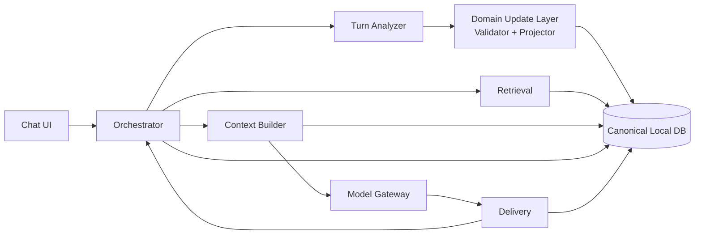

# TEXT_V01_IMPLEMENTATION_SPEC.md

- Project: 自立型AI / 継続人格型デジタルコンパニオン
- Spec: Text v0.1 非コード実装仕様
- Version: 2026-09-27-r2
- Status: 実装仕様化済み / 実コード未着手
- Canonical parent: `PROJECT_HANDOFF.md` r13以降

> この文書は「実コードを書かずに、Codexが迷わず実装へ入れる境界まで仕様を固定する」ための詳細仕様。アプリケーションコード、DB migration、API実装、テストコードは含めない。

---

# 1. 実装対象

Text v0.1のP0は、次の一連の利用経路を完成させる。

1. ユーザーがテキストを送信する。
2. User Turnをcanonicalに確定する。
3. 明示command（remember / forget等）があればforegroundで扱う。
4. Recent context / Domain snapshot / Retrievalを並列準備する。
5. immutableなContext Capsuleを組み立てる。
6. Main Dialogue Modelを1回呼ぶ。
7. 返答をstream deliveryする。
8. 実際にUIへdeliveryされた範囲をcanonical assistant messageとして確定する。
9. Turn Analyzerをbackgroundで1回実行する。
10. Analyzer proposalをValidator / Projectorで検証し、Atomic Domain Commitする。
11. 次turnはAnalyzer完了を待たず開始できる。

P0ではVoice / TTS / ASR / Avatar / Web / PC操作 / Game操作 / autonomous activityを実装対象にしない。ただしEvent/Turn契約は将来Voiceへ拡張可能なものを使う。

---

# 2. P0 component topology

P0の最小runtime componentは6つ。Domainの確定mutationだけは共通のDeterministic Domain Update Layerが担う。

## 2.1 Component IDs

| Component ID | Name | P0形態 |
|---|---|---|
| `CMP-ORCH-01` | Orchestrator | local / canonical runtime coordinator |
| `CMP-RETR-01` | Retrieval | local, read-only against canonical state |
| `CMP-CTX-01` | Context Builder | local, pure-ish snapshot assembler |
| `CMP-GW-01` | Model Gateway | local adapter; model runtime may be local/remote |
| `CMP-DLV-01` | Delivery | local UI delivery truth owner |
| `CMP-ANL-01` | Turn Analyzer | async semantic proposal producer |
| `SUB-DUP-01` | Domain Update Layer | deterministic local validator/projector; service化しない |

`SUB-DUP-01`は7つ目の独立serviceではない。canonical Domain mutationの共通境界を明示する内部層。

---

# 3. Contract Matrix

| Component | Primary input | Primary output | Canonical state ownership | 禁止事項 | Failure class | Degrade behavior |
|---|---|---|---|---|---|---|
| Orchestrator | committed user turn / component events / commands | component commands / turn phase events / attempt lifecycle | `TURN_RUN` lifecycle、turn sequence、cancel scope、deadline、attempt coordination | Memory/Self/User/Relationshipの意味内容を独自判断して直接変更しない | foreground critical | in-flight turnをabort可能。未commit Domainを残さない |
| Retrieval | retrieval request + current revision/filter | retrieval snapshot | canonical Domainは所有しない。retrieval trace/cacheのみ | soft-deleted/forbidden sourceを返さない。Domain mutationしない | foreground degradable | vector失敗→lexical、lexical失敗→vector、両方失敗→empty degraded snapshot |
| Context Builder | committed input + domain snapshot + retrieval snapshot + provider budget | immutable context capsule | canonical Domainは所有しない。snapshot metadataのみ | DBを変更しない。secret/soft-deleted/remote-suppressed contextを混入しない | foreground critical if current input/identity missing; otherwise degradable | low-priority contextをtrimしMainへ進む |
| Model Gateway | normalized generation request + context capsule | normalized generation stream + invocation result | provider session/cacheのみ | provider固有eventをCoreへ露出しない。Domain mutationしない | foreground critical/degradable | delivery前のみpolicyに従いfallback。delivery後のsilent model swap禁止 |
| Delivery | normalized text stream + cancel state | delivery checkpoint / completed / stopped / failure | **delivery truth**。canonical assistant content確定の根拠 | 未render textを「言ったこと」にしない。Domain semantic updateしない | foreground critical after generation | partial deliveryをcanonicalに確定可能。未render tailはtrace only |
| Turn Analyzer | canonical user input + delivered assistant + bounded context | `TurnAnalysisV1` proposals | canonical Domainは所有しない | UUID/time/confidence/lifecycle/delete/promotion/relationship valuesを決定しない | background | failure→pending retry。Chatは継続 |
| Domain Update Layer | Analyzer proposal / explicit deterministic command / base revision | accepted/rejected update set + new revision | Memory/Self/User/Relationship/Affectのcanonical mutation | stale proposalのblind overwrite、soft-delete resurrection、partial commit | hard fail-closed for invalid mutation | atomic reject/rollback。会話自体は維持 |

---

# 4. State ownership

## 4.1 Single-writer原則

| State | Writer/owner | Other component access |
|---|---|---|
| Turn phase / sequence / cancel scope | Orchestrator | read via Event/Snapshot |
| User canonical `MESSAGE` | Orchestratorによるcommit path | read-only elsewhere |
| Assistant canonical `MESSAGE.content` | Delivery truthを根拠にOrchestratorが確定 | Analyzer/Contextは確定後read |
| Memory / Self / User / Relationship / Affect | Domain Update Layer | Retrieval/Contextはread-only |
| Retrieval result | Retrieval | Context/Orchestrator read |
| Context Capsule | Context Builder | immutable read-only |
| Model provider session/cache | Gateway | Coreからopaque |
| Analyzer raw proposals | Analyzer | Validator/Inspector read |
| Developer trace | 各componentが自component attempt/eventを追記 | canonical truthとして使用しない |

### 不変条件
- 複数componentが同じcanonical Domain entityを直接更新しない。
- `MESSAGE.content`のassistant側canonical truthは「生成済み」ではなく「delivery済み」。
- cache / prefetch / provisional resultはcanonical stateではない。

---

# 5. Component contract details

## 5.1 `CMP-ORCH-01` Orchestrator

### 責務
- 1 turnの開始・進行・終了を統括。
- component callの並列化、priority、deadline、cancelを管理。
- EventEnvelopeの`turn_id / sequence / causation / attempt_id`をローカル権威として付与。
- foregroundとbackgroundを分離。
- explicit commandを通常会話より先に認識して必要なdeterministic pathへ送る。

### Input
- `TextSubmit`
- `UserTurnCommitted`
- Retrieval / Context / Gateway / Delivery / Analyzerの結果Event
- `CancelScope`
- explicit command result

### Output
- `RunRecall`
- `BuildContextCapsule`
- `StartGeneration`
- `AnalyzeCommittedTurn`
- attempt start/cancel/deadline events
- Turn terminal status

### Owned State
- `TURN_RUN` phase
- local event sequence
- in-flight attempt map
- cancel/supersede scope
- turn-level deadlines

### Must not own
- Memory semantic truth
- Self/User/Relationship value
- model-specific generation semantics
- UI-rendered delivery span itself

### P0 terminal states
- `completed`
- `completed_partial`
- `failed_before_delivery`
- `cancelled`

`completed_partial`は「一部delivery後にMain/Gateway/Delivery failureが発生したが、実際にdeliveryした内容をcanonicalに確定して終了」の意味。

### Failure rules
- Retrieval failureだけではturn全体を失敗させない。
- Analyzer failureはforeground turn statusへ影響しない。
- Context current-input欠損 / identity hard rule欠損 / canonical DB corruptionはfail-closed。
- Main failureがdelivery前ならfallback policyを試せる。
- Main failureがdelivery後なら別modelで文章を継ぎ足さずpartial終了。

---

## 5.2 `CMP-RETR-01` Retrieval

> Field-level P0 contractのcanonical詳細は `RETRIEVAL_P0_SPEC.md`。本節と矛盾する場合は同ファイルのv1契約を優先し、scoring数値の最終値は実測後に決める。

### 責務
- Current user turnに関連する過去情報をcanonical stateから取得。
- extracted Memoryとraw conversation evidenceの双方を扱える。
- lexical / semanticの結果を統合する。
- Retrieval結果はあくまで候補であり、発話強制ではない。

### Input contract: `RetrievalRequestV1`
必須意味項目:
- `turn_id`
- `query_text`: canonical user text
- `state_revision`
- `allowed_source_classes`
- `excluded_memory_statuses`（最低`soft_deleted`）
- `max_result_count`
- `context_budget_hint`
- current conversation/user/AI scope

任意:
- stable partial由来のprefetch marker（Voice将来用）
- previous hot-context references

### Output contract: `RetrievalSnapshotV1`
- `retrieval_run_id`
- `state_revision`
- `degraded_mode`
- ranked results
- source kind: `memory_item | raw_message`
- canonical source reference
- score components（semantic/lexical/recency/importance等、利用したものだけ）
- final rank
- selected/not-selected reason
- elapsed metrics

### Hard constraints
- soft-deleted Memoryは候補にも含めない。
- source referenceが存在しない結果を返さない。
- secret suppression対象をremote用Context候補へ載せない。
- archived Memoryは除外ではなく通常scoreを下げる。明示言及時は候補になれる。

### P0 retrieval strategy
- lexicalとvectorを並列に扱えるcontractを前提とする。
- fusion algorithmそのものはRuntime Profile設定で交換可能。
- rerankerはP0必須ではない。

### Degradation
1. vector unavailable → lexical only。
2. lexical unavailable → vector only。
3. 両方 unavailable → empty `degraded_mode=recall_unavailable`。
4. timeout →到着済み結果だけでbounded completion、またはempty snapshot。

どのdegradeでもDomain mutationは禁止。

---
