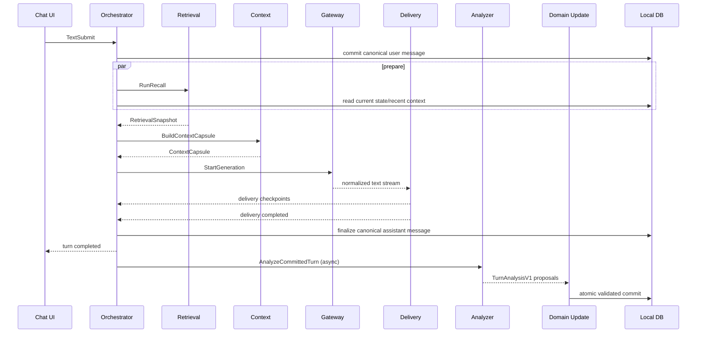

# 6. P0 normal sequence



### Foreground completion point
Text v0.1ではユーザーが次turnへ進めるためにAnalyzer完了を待たない。

---

# 7. Degradation Matrix

| Failure | User-facing turn | Canonical Domain | Required trace |
|---|---|---|---|
| Vector retrieval timeout | lexical-onlyで継続 | no mutation | degraded retrieval mode |
| 全Recall unavailable | recent contextだけで継続 | no mutation | recall_unavailable |
| Context low-priority section oversized | trimして継続 | no mutation | omitted sections |
| Hard identity/current input欠損 | generation開始しない | unchanged | critical context failure |
| Remote Main failure before delivery | allowed fallback | unchanged until delivery | attempt1 fail + attempt2 |
| Main failure after partial delivery | partialで終了 | delivered contentのみconversationへ | completed_partial |
| UI delivery failure before any render | turn failed before delivery | assistant message未確定/failed扱い | delivery fail |
| UI delivery failure after partial render | partial canonical response | rendered span only | final checkpoint |
| Analyzer invalid schema | Chat unaffected | no mutation | analyzer rejected |
| Analyzer timeout | Chat unaffected | no mutation until retry | pending_retry |
| Stale Analyzer vs User Forget | Chat unaffected | forget wins; resurrection禁止 | rejected_stale/forget_boundary |
| Domain transaction failure | Chat unaffected | rollback | commit failure |

---

# 8. Priority / scheduling

P0 priority classes:

| Priority | Work |
|---|---|
| P0 | current user-facing Main generation / Delivery |
| P1 | explicit remember/forget commands、canonical user commit |
| P2 | Retrieval / Context preparation for current foreground turn |
| P3 | Turn Analyzer |
| P4 | later Reflection / Consolidation / Archive review |

ルール:
- P0/P1到着時、P3/P4はdelay/cancel可能。
- AnalyzerがGPUを占有してMain TTFTを悪化させる構成は不合格。
- Current foreground turnのRetrievalはAnalyzerより優先。

---

# 9. Deployment profile: Text v0.1

## 9.1 Canonical architecture

- Desktop app / local processにAI Coreを置く。
- Canonical relational stateはlocal SQLiteを第一候補。
- Model runtimeはGateway外部workerとして扱える。
- Main modelはLocal/Colabを交換可能。
- AnalyzerもMainとは別profileとして交換可能。
- Remote workerはcanonical stateを保持しない。

## 9.2 初期profile候補

### `LOCAL_ONLY`
- Core: local
- DB: local
- Retrieval: local
- Main: local
- Analyzer: local

### `HYBRID_COLAB_MAIN`
- Core: local
- DB: local
- Retrieval: local
- Main: Colab worker
- Analyzer: local有力

両profileで上位Event/Component contractは同一。

---

# 10. Context and privacy boundaries

Remoteへ送信禁止:
- soft-deleted Memory
- secret filter対象
- explicit local-only/private suppression対象
- Developer-only traceでMain会話に不要な情報
- raw DB dump

Remoteへ必要最小限送信:
- Identity minimum
- current user turn
- bounded recent conversation
- selected relevant Self/User/Relationship
- selected Memory evidence
- current state summary

Analyzerへも同様にbounded/whitelisted入力を使う。

---

# 11. Observability contract

各turnでDeveloper Inspectorから最低限確認可能にする。

## Turn
- turn ID
- start/end status
- state revision used
- completion type (`completed / completed_partial / failed_before_delivery / cancelled`)

## Retrieval
- query
- source classes
- results/ranks/scores
- degraded mode
- elapsed time

## Context
- section token counts
- selected IDs
- omitted sections/reasons
- stable prefix fingerprint

## Main invocation
- provider/runtime/model
- attempt ID
- input/output tokens
- TTFT
- total duration
- failure/fallback

## Delivery
- generated length
- delivered length
- final canonical span

## Analyzer
- analyzer model/version
- proposal counts by class
- validation outcome
- rejected proposal + reason
- commit revision

Private chain-of-thoughtは保存対象にしない。

---

# 12. Acceptance criteria by component

## Orchestrator
- 同一turnでEvent sequenceが一意に再現可能。
- Analyzer未完のまま次turnを開始可能。
- cancelled/superseded late resultがUI/DBへ漏れない。

## Retrieval
- soft-deleted Memoryが0件。
- vector/lexical片系停止で会話継続可能。
- raw messageとextracted Memoryのどちらを選んだか追跡可能。

## Context
- 同一Input Snapshotから同一selection policy versionなら再現可能。
- hard rule/current inputをtoken trimで失わない。
- selected evidence IDから元sourceへ辿れる。

## Gateway
- Local/Colab差替でもCore event schemaが同一。
- delivery前fallbackとdelivery後no-silent-switchが守られる。

## Delivery
- stream途中cancel/failureで未表示tailをcanonical化しない。
- canonical assistant messageと最終delivery checkpointが一致。

## Analyzer
- Empty resultがvalid。
- invalid schemaでDomain mutation 0。
- Self/User混同・secret・undelivered tailのGoldenを通す。

## Domain Update
- stale revisionでblind overwrite 0。
- User Forget後のresurrection 0。
- transaction failureでpartial mutation 0。

---

# 13. P0 work packages for Codex（まだ実コード開始指示ではない）

仕様上の実装単位を以下に固定する。

| WP | Scope | 完了条件 |
|---|---|---|
| `WP-TXT-01` | Canonical Domain schema + repository contract | ERのv0.1 entity/constraintを表現し、soft-delete/provenance/revision境界が定義通り |
| `WP-TXT-02` | Turn/Event/Attempt lifecycle | r9-r11 Event/Goldenを満たす状態機械境界 |
| `WP-TXT-03` | Retrieval component | degraded path込みで`RetrievalSnapshotV1`を返す |
| `WP-TXT-04` | Context Builder | immutable `ContextCapsuleV1` + token budget trace |
| `WP-TXT-05` | Gateway + Main streaming | provider正規化、pre-delivery fallback、post-delivery no-swap |
| `WP-TXT-06` | Text Delivery truth | render checkpointからcanonical assistant content確定 |
| `WP-TXT-07` | Turn Analyzer | `TurnAnalysisV1` proposal only、no mutation |
| `WP-TXT-08` | Validator/Projector | proposal→atomic Domain commit、forget/stale/secret guard |
| `WP-TXT-09` | Developer Inspector minimum | Turn/Recall/Context/Model/Delivery/Analyzer trace可視化 |
| `WP-TXT-10` | Golden Harness | GS-ORCH/AN-GOLDを同一snapshotからreplay可能 |

依存順:

```text
WP-TXT-01
  ↓
WP-TXT-02
  ↓
WP-TXT-03 + WP-TXT-04
  ↓
WP-TXT-05 + WP-TXT-06
  ↓
Text foreground vertical slice
  ↓
WP-TXT-07 + WP-TXT-08
  ↓
Persistent personality/memory vertical slice
  ↓
WP-TXT-09 + WP-TXT-10
```

---

# 14. Explicitly not decided yet

次は実機/benchmarkで決める。現段階では実装仕様から分離する。

- Main modelの最終採用（Bonsai 2含む）
- Analyzer modelの最終採用
- Local Main vs Colab Mainの既定profile
- Vector index/store実装方式
- fusion weightの最終値
- Contextの具体token budget（2k/4k/8k等）
- reranker常設の有無
- speculative decoding
- prompt cache/runtime固有最適化
- VoiceのASR/TTS/Turn detector実装

これらが未決でもP0 component contractは変えない。

---

# 15. ER影響

今回のComponent Contract固定では**Domain ER Entityを追加しない**。

既存Domain ERがcanonical semantic stateを表し、既存Technical Trace ERの`TURN_RUN / MODEL_INVOCATION / TURN_ANALYSIS / COMPONENT_ATTEMPT / CONTEXT_SNAPSHOT / DELIVERY_SPAN / CANCELLATION_SCOPE`がruntime traceを担う。

追加したものはcomponent boundary / ownership / interface contractであり、データモデル変更ではない。

---

# 16. Non-code implementation status

以下は「仕様として実装済み」と扱う。
- P0 component boundary
- component input/output responsibility
- canonical state ownership
- failure/degradation policy
- delivery truth boundary
- fallback boundary
- background Analyzer boundary
- Domain mutation boundary
- Codex work package decomposition

以下はまだ「実装済み」ではない。
- application source code
- database migration
- model server deployment
- automated test code
- benchmark result
- hardware-specific tuning

---
